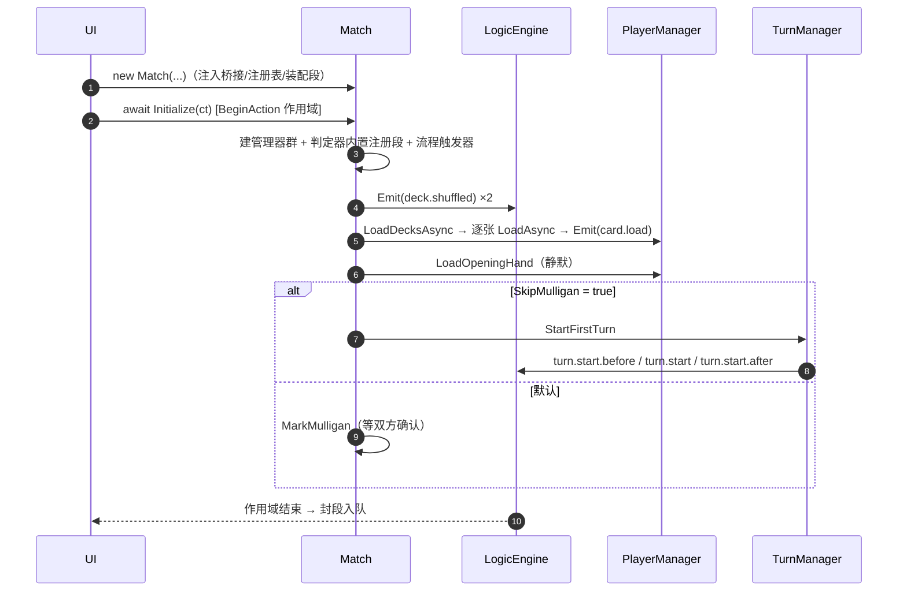

# 01 · 对局初始化与终局

> **覆盖**：① 对局初始化、⑱ 初始化补充（卡牌加载 / 效果初始化 / 判定器初始化与预定义 moding）、② 换牌 Mulligan、⑮ 终局收尾（HQ≤0 / Concede）。
> **内容边界**：含以上四段全序。**不含**：单卡打出链（→ [`04`](04-打出与部署.md)）、回合内资源结算细节（→ [`02`](02-回合与资源.md)）、抽牌/爆牌（→ [`03`](03-卡牌管理.md)）、效果体系详解（→ [`08`](08-效果体系.md)）。
> **相关文件**：[`02`](02-回合与资源.md)（首回合五连）、[`03`](03-卡牌管理.md)（起手/加载）、[`08`](08-效果体系.md)（效果装载）。

---

## ① 对局初始化

### 触发 / 前置
- 构造：`new Match(deckForPlayerA, deckForPlayerB, cardDefinitions, …)`（准备态；此时**不建管理器、不建玩家**）。
- 初始化：`await match.Initialize(ct)`（仅 `Preparing` 可调；重复调用抛错）。

### 构造注入参数（扩展点 · 构造注入）

| 参数 | 作用 |
|---|---|
| `deckForPlayerA` / `deckForPlayerB`（`CardList`） | 双方卡组名单（创建期即校验非空/无空 id） |
| `cardDefinitions` | 卡定义集；Initialize 内批量注册 |
| `seed`（`int?`） | 随机种子（缺省自生成，事后 `Match.Seed` 可读） |
| `firstPlayerIndex`（`int?`） | 先手指定（0=A/1=B；缺省 0） |
| `options`（`MatchOptions?`） | 规则配置（点槽上限、起手张数、首回合是否抽牌、`SkipMulligan`） |
| `targeterBridge`（`ITargeterBridge?`） | **目标选择桥接（UI 必传；缺省则选靶以失败结局暴露，不抛）** |
| `effectRegistry`（`CardEffectRegistry?`） | 效果工厂注册表（卡加载时效果装载源） |
| `deckConfigForPlayerA/B` | 构筑配置（主国/盟国；成对提供即校验） |
| `judicatorAssembly`（`Action<JudicatorRegistry>?`） | 判定器外部装配段（追加/定制） |

> 构造后即暴露 `Match.Engine`（`LogicEngine`）——**订阅 / 即时监听必须在 `Initialize` 之前挂接**。

### 分步骤表（`Match.Initialize`）

> 整体包在一次**动作作用域**（`Engine.BeginAction()`）内——初始化产生的全部信号合并为**一段**。

| 步 | 代码位置 | 语义 | 发射信号 |
|---|---|---|---|
| 0 | `Match.Initialize` | 注册装载管线"装载完成动作" | — |
| 1 | `CardLibrary` 构建 + 批量 `Register` | 建卡库、注册全部定义 | — |
| 2 | `ResourceManager` → `PlayerManager` → `CreatePlayers` | 建资源/玩家管理器与玩家对象 | — |
| 3 | `BattlefieldManager` | 建战场（含 HQ 占位） | — |
| 4 | 构筑配置注入 | 主国/盟国 | — |
| 5 | `GameEnvironment` | 游戏环境（只读查询面） | — |
| 6–9 | 随机服务 / `MatchCardService` / `MatchHistoryService` / `TargeterManager` | 各服务装配并注入玩家 | — |
| 10 | 判定器注册表 + **J2 内置注册段** | `validation.cost.check`、`validation.counter.use` | — |
| 11 | **K1 内置注册段** | `combat.range` / `combat.guard.eligibility` / `combat.interception` / `combat.target.legal` | — |
| 12 | **K2 内置注册段** | `combat.counter.eligibility` / `combat.ambush.condition` | — |
| 13 | **K3 内置注册段** | `move.leg.eligibility` / `attack.leg.eligibility` / `move.frontline-enemy` / `validation.move.recheck` / `validation.attack.recheck` | — |
| 14 | 默认 `CSharpScriptEvaluator` | 宿主已装配则不覆盖 | — |
| 15 | **E1 内置注册段** | `effect.target.resolve` + 点槽/点数包裹判定器族 | — |
| 16–17 | `EffectRuntime` / `MatchNamedTriggers` | csx 受控入口；登记 4 个对局级具名触发器 | — |
| 18 | **外部装配段** `judicatorAssembly` | 追加/定制判定器（重复注册默认名被拒） | — |
| 19–21 | `RetriggerSystem` / `CommandManager` / 4 流程触发器登记为 `LowLevel` | 再触发与指挥基础设施 | — |
| 24 | HQ 数值基线快照 | 零变化 / 零发射 | — |
| 25 | `ShuffleDeckAsync(A)` → `ShuffleDeckAsync(B)` | 双方洗切 | **`deck.shuffled` ×2** |
| 26 | `PlayerManager.LoadDecksAsync` | 逐张加载（A 组先、B 组后；组内＝洗牌后顺序） | **`card.load` × 每张** |
| 27 | `SnapshotCardIdWatermark()` | 卡牌 ID 水位线（"构筑之外"判定基准） | — |
| 28 | `PlayerManager.LoadOpeningHand`（先手 4 / 后手 5） | 起手装载 | **静默（零信号）** |
| 29–31 | `TurnManager` / `PlayManager` / `MulliganManager` | 回合 / 打出 / 换牌管理器 | — |
| 32a | `SkipMulligan==true` | 立刻 `StartFirstTurn` + `MarkInProgress` | **回合五连前三连**（见 [`02`](02-回合与资源.md)） |
| 32b | **默认** `SkipMulligan==false` | `MarkMulligan` → 停在换牌相位 | **暂停，无回合信号** |

### 时序图（主干）

### 关联效果预制体
- 本流程位对应模板：`load_basic`（`card.load`）、`shuffle_basic`（`deck.shuffled`）；首回合前三连见 `turn_start*_basic`。详见 [`08`](08-效果体系.md)。

### 前端对接要点
- **监听必须在 `Initialize` 之前注册**：`engine.OnImmediateUpdate(...)` + 帧循环 `TakeSegments()`，否则错过初始化段。
- 初始化是**一段**：段内可顺序读到 `deck.shuffled` → `card.load`（逐张）→（视配置）回合前三连。
- 起手装载**无信号**——不要指望用 `card.drawn`/`card.hand.add` 感知起手；起手牌通过读 `Player.Hand` 获取。
- 记录 `Match.State` 判定当前阶段；`Match.Phase` 在 `Preparing` 下读取会抛错。

### 能力现状
- 缺省 `SkipMulligan=false` → Initialize 结束停在 `Mulligan`，**不发射回合信号**。
- 无默认效果/卡库装载器时，卡上无声明效果（`effectRegistry` 缺省 null）。

---

## ⑱ 初始化补充：卡牌加载 / 效果初始化 / 判定器初始化与预定义 moding

### A. 卡牌加载（`CardBase.LoadAsync(owner, ct)`）

| 步 | 代码位置 | 语义 |
|---|---|---|
| 1 | `CardBase.LoadAsync` | 设 `Owner` |
| 2 | `LoadMatchCardId()` | 对局级 ID 分配（幂等；水位线由此推进） |
| 3 | `LoadComponentPhaseAsync(ct)` | **两段式组件加载** |
| 4 | `LoadEffectsAsync(ct)` | 效果装载（X2） |
| 5 | `GameUpdates.EmitCardLoad(...)` | **广播 `card.load`（加载模板的最后一步）** |

**两段式组件加载**：
- **构造期组件**（构造函数内同步执行，`Phase == Construction`）：`typeCategory` / `factionCost` / `battleStats`。
- **加载期组件**（`LoadComponentPhaseAsync`）：
  - 第一段：`IsBuiltIn && Phase == Load`，按**游戏层注册序**（防依赖丢失），失败＝fail-fast 上抛。
  - 第二段：数据体剩余组件（`Definition.Components` 声明序），扩展/社区组件；未注册名＝隔离记录、执行异常＝隔离跳过。

### B. 效果初始化（装载链）

| 步 | 代码位置 | 语义 |
|---|---|---|
| 1 | `CardEffectRegistry.Register(effectId, factory)` | 装配期登记效果工厂（注册即配置、重复拒绝） |
| 2 | `CardEffectRegistry.Declare(cardId, effectIds)` / `DeclarePrefab(cardId, prefabIds)` | 声明"某卡挂哪些效果/预制体" |
| 3 | `Match.Initialize` 注册"装载完成动作" | `LogicEngine.RegisterCardMountCompletedAction`（装载管线扩展点） |
| 4 | `CardBase.LoadEffectsAsync` | 按声明把效果实例挂到卡上 |
| 5 | 效果 `OnMount` / `OnUnmount` | 作者钩子（挂载/卸载生命周期） |
| 6 | 效果 `Inject<TView>(...)` / 预制体 `injects` | 注入流程触发器具名 band 或具名触发器 |

> 详见 [`08-效果体系.md`](08-效果体系.md)。

### C. 判定器初始化与预定义 moding

| 步 | 代码位置 | 语义 |
|---|---|---|
| 1 | `JudicatorRegistry` 创建 | `Match.Initialize` 装配链固定位置 |
| 2 | **内置注册段** | 19 条内置判定器（4 验证 + 6 交战 + 3 动作资格 + 1 效果选靶 + 5 资源） |
| 3 | **外部装配段** `judicatorAssembly` | 追加/定制（如示范类 `deck.top.tag` / `targeting.candidate.eligibility`） |
| 4 | 预定义 moding 应用 | `JudicatorRegistry.RegisterModing(name, moding)` 全局改写；`UnregisterModing` 回退 |
| 5 | 解析点 | `JudicatorBinding` → 每次取 moding 栈顶（改写后全部调用点同步生效） |

> **预定义 moding**：判定器名（`JudicatorNames`）是"可被改写逻辑服务"的引用标识。已内置 19 条 + 外部可注册 2 条示范。前端**通常不直接调用**；理解它能解释"为何同一逻辑可被整体替换"。

### 前端对接要点
- `card.load` 载荷 `{Player, Card}`；加载顺序＝玩家索引升序 × 洗牌后卡组序。
- 效果/判定器装配均为**装配期**行为，**对局开始后不再变化**（moding 可在运行期注册/回退）。

### 能力现状
- 数据体（`*.card.json`）里未注册的组件名＝隔离记录，不阻断加载。

---

## ② 换牌 Mulligan

### 触发 / 前置
- 入口：`Match.BeginMulliganAsync(player, ct)`（换牌 + 自动确认）与 `Match.MulliganDone(player, ct)`（不换直接确认）。
- 门禁：仅 `Mulligan` 相位 ∧ 该方未确认；重复确认 = 明确拒绝（零副作用）。

### 分步骤表

| 步 | 代码位置 | 语义 |
|---|---|---|
| 1 | `MulliganManager.BeginMulliganAsync` | 经**特制槽位** `MulliganSelectSlot` 交互选择要退回的牌（0..手牌数；槽位参数＝该玩家） |
| 2 | `MulliganManager.ConfirmAsync` | 确认：退回卡组 → 重洗（**恰一条 `deck.shuffled`**）→ 抽等量（**静默**，不发 `card.drawn`/`card.hand.add`）→ **自动确认该方** |
| 3 | 双方确认 | 经装配回调：置 `InProgress` + 执行先手第 1 回合（`StartFirstTurn` → 回合前三连） |

> 取消交互 = 零副作用（不换牌、不确认）。

### 关联效果预制体
- 重洗发 `deck.shuffled` → 对应 `shuffle_basic`；次段回合前三连 → `turn_start*_basic`。

### 前端对接要点
- 换牌用**专用选择器** `mulligan`（`SelectorTemplates.Mulligan`）——前端需实现 UI 呈现，经会话逐个取选择器并提交语义事件应答（见 [`06`](06-目标选择（异步倒置）.md)）。
- 换牌阶段**不刷手牌动画**式抽牌（静默补牌），但可读一次性 `deck.shuffled`。

### 能力现状
- 已实现（`MulliganResult` 三态）。
- ⚠ `GameEntryPoints.cs` 仍把该组记为 `PendingDelivery` 并写作 `MulliganReplace`——**已滞后，以 `Match.cs` 为准**。

---

## ⑮ 终局收尾

### 触发 / 前置
- 两条**共用同一"置结束"单源路径**（`MatchLifecycle.End`）：
  1. **HQ≤0**：`Hq.RespondToZero()`（由 `CommandManager` 的 `HqZeroTrigger` 响应 `card.stat.changed` 触发）。
  2. **认输 `Concede(player, ct)`**：仅 `InProgress`；重复/非法相位 = 明确拒绝。

### 分步骤表

| 步 | 代码位置 | 语义 |
|---|---|---|
| 1 | `Hq.RespondToZero()` 或 `Match.Concede` | 判定胜负方 |
| 2 | `MatchLifecycle.End(winner, reason)` | 置 `Ended` + 记录 `Winner`/`EndReason`（非 `InProgress` 幂等忽略） |
| 3 | — | 终局**不发射额外更新**（更新流不再增长） |

### 结果取值

| 读面 | 取值 |
|---|---|
| `Match.Winner` | `Player?`（终局后非 null） |
| `Match.EndReason` | `MatchEndReason`：`HqZero` / `Concede` |
| `ConcedeResult` | `Accepted()` / `Rejected(ConcedeFailureReason.GameEnded\|PhaseBlocked)` |

### 前端对接要点
- 终局后：`Match.State==Ended`、`Match.Phase==Ended`；动作入口拒绝，只读查询面（玩家/战场/环境/判定器/历史）仍可用；`RandomService`/`CardService`/`EndTurn`/`ShuffleDeckAsync` 取用会抛错。
- 胜负通过 `Winner`/`EndReason` 读取，**不要**靠信号时间差推断。

### 能力现状
- `Concede` 为**同步**调用（返回 `ConcedeResult`），非待交付。
- 缺口标注（`GameHooks.PendingTriggers`）：kards 的 `enemyKilled` / `afterKill` / `friendlyDeath` 等为 **`Deferred`**；压制/沉默/撤退/存活/充能等为 **`NotPlanned`**（详见 [`05`](05-指挥与交战.md) 与主索引入口）。
