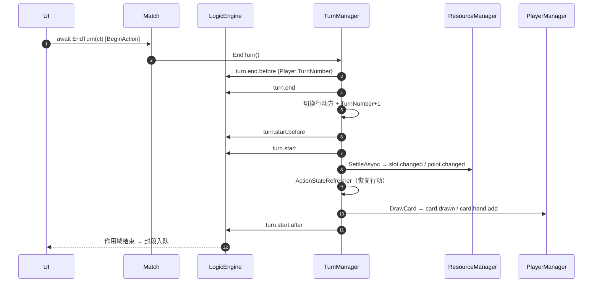

# 02 · 回合与资源

> **覆盖**：③ 回合流程（回合五连 + 行动状态恢复 + 抽牌位）、④ 资源结算（指挥点槽 / 点数）。
> **内容边界**：含回合推进编排与资源结算。**不含**：抽牌/爆牌细节（→ [`03`](03-卡牌管理.md)）、首回合与初始化（→ [`01`](01-对局初始化与终局.md)）、数值修饰链内部（→ [`07`](07-修饰器与光环.md)）。
> **相关文件**：[`01`](01-对局初始化与终局.md)（首回合）、[`03`](03-卡牌管理.md)（抽牌）、[`07`](07-修饰器与光环.md)（数值变化）。

---

## ③ 回合流程

### 触发 / 前置
- 首回合：`TurnManager.StartFirstTurn(firstPlayer)`（由初始化/换牌确认触发；`internal`）。
- 结束回合：`await Match.EndTurn(ct)`（仅 `InProgress`；准备/换牌/终局 → 抛 `InvalidOperationException`）。
- 真源：`TurnManager`（`CurrentPlayer` / `TurnNumber`）。

### 回合五连信号

| 常量（`GameUpdates`） | 字面值 | 时机 |
|---|---|---|
| `TurnStartBefore` | `turn.start.before` | 回合开始**前**（未结算、未抽牌） |
| `TurnStart` | `turn.start` | 回合开始 |
| `TurnStartAfter` | `turn.start.after` | 回合开始**后**（结算+抽牌完成） |
| `TurnEndBefore` | `turn.end.before` | 回合结束**前** |
| `TurnEnd` | `turn.end` | 回合结束 |

载荷：`{ Player, TurnNumber }`。

### 分步骤表（`TurnManager.BeginTurnAsync`）

| 序 | 代码位置 | 语义 | 信号 |
|---|---|---|---|
| ① | `TurnManager.BeginTurnAsync` | 发回合开始前 | **`turn.start.before`** |
| ② | 同上 | 发回合开始 | **`turn.start`** |
| ③ | `ResourceManager.SettleAsync(current)` | **资源结算**（点槽递增+点数回满） | `slot.changed` / `point.changed`（有变化才发） |
| ④ | `ActionStateRefresher`（＝`CommandManager.RefreshActionStates`） | 恢复单位行动状态 | — |
| ⑤ | `PlayerManager.DrawCard(current)`（`ShouldDrawForTurn` 为真时） | 抽牌 | `card.drawn` / `card.hand.add`（可能爆牌） |
| ⑥ | `TurnManager.BeginTurnAsync` | 发回合开始后 | **`turn.start.after`** |

### 分步骤表（`TurnManager.EndTurn`）

| 序 | 代码位置 | 语义 | 信号 |
|---|---|---|---|
| 1 | 生命周期门禁 | 终局/非进行相位 → 抛错 | — |
| 2 | `_currentPlayer` 快照 | 取当前行动方 | — |
| 3 | `EmitTurnAsync(TurnEndBefore)` | — | **`turn.end.before`** |
| 4 | `EmitTurnAsync(TurnEnd)` | — | **`turn.end`** |
| 5 | 切换行动方 | `_currentPlayer = Players[(ending.Index+1)%2]` | — |
| 6 | `TurnNumber += 1` | 回合数递增（**点数不清零**，下回合回满覆盖） | — |
| 7 | `await BeginTurnAsync(ct)` | 无缝进入下一回合开始序列 | 见上表 |

> `Match.EndTurn` 在委托前开一次**动作作用域**（`Engine.BeginAction()`）——整条结束回合链聚合为一段。

### 时序图（主干）

### 关联效果预制体
- `turn_start_before_basic` / `turn_start_basic` / `turn_end_before_basic` / `turn_end_basic`。

### 前端对接要点
- 回合横幅用 `turn.start.before`（最早）与 `turn.end`；**首回合不抽牌**（`ShouldDrawForTurn`：全局回合 1 默认不抽，除非 `AllowFirstTurnDraw`）。
- 行动状态在 `turn.start` 与 `turn.start.after` **之间**恢复——别在 `turn.start` 一响就假设单位可动。
- 收尾段（`turn.end.*`）与下一回合起始段可能同属**一段**（`EndTurn` 一次动作），注意段内顺序。

### 能力现状
- 回合结束**不**内置"天气/落雪"等（kards-diy 有、本引擎无）。

---

## ④ 资源结算

### 触发 / 前置
- `ResourceManager.SettleAsync(player, ct)`（回合开始③环节调用）。
- 受控加/改：`ResourceManager.AddPointsAsync` / `ChangePointsAsync`。
- 上限：点槽上限 `MatchOptions.MaxPointSlots`（默认 12）。

### 分步骤表

| 步 | 代码位置 | 语义 | 信号 |
|---|---|---|---|
| 1 | `ResourceManager.SettleAsync` | 递增判定器求增量（默认 1） | — |
| 2 | 同上 | `target = Min(PointSlots + increment, MaxPointSlots)` | — |
| 3 | `SetSlotsAsync(target, emitChanged:true)` | 槽值真变化才发 | **`slot.changed`**（未变不发） |
| 4 | `ChangePointsAsync(PointSlots, Set)` | 点数＝槽值；值变化才发 | **`point.changed`**（未变不发） |

> `SettleAsync` **不发** `slot.gained` / `slot.lost`。

### 信号与来源

| 信号 | 发射点（方法） | 语义 |
|---|---|---|
| `slot.changed` | `ResourceManager.SetSlotsAsync` | 槽值真的变了（唯一"槽变化"信号） |
| `slot.gained` | `ResourceManager.GainSlotsAsync` | 额外获得槽（Δ>0，语义前置） |
| `slot.lost` | `ResourceManager.LoseSlotsAsync` | 失去槽（Δ>0，语义前置） |
| `point.changed` | `ResourceManager.SetPointsAsync` | 点数变化（含 Settle/Add/Gain/Lose） |
| `point.gained` | `ResourceManager.GainPointsAsync` | 卡效果"获得 n 点" |
| `point.lost` | `ResourceManager.LosePointsAsync` | 卡效果"失去 n 点" |

载荷：`slot.*` → `{Player, OldSlots, NewSlots}`；`point.*` → `{Player, OldPoints, NewPoints}`；`point.changed` 另有 `{Amount}`（Δ）。

### 关联效果预制体
- `slot_gained_basic` / `slot_lost_basic`（监听语义前置信号）；`point.*` 无独立模板（走 `stat_basic`/直接信号）。

### 前端对接要点
- **有变化才发**：无变化零发射（P1 原则）——空结算不产信号、不产段。
- 顺序通例：语义前置（`slot.gained` → `slot.changed`）。UI 若"按来源处理避免重复播放"，注意两者可能同帧到达。

### 能力现状
- 槽硬上限（kards 的 `kreditSlotHardCap=36`）本引擎未单独建模，扩槽经 `GainSlotsAsync`。
