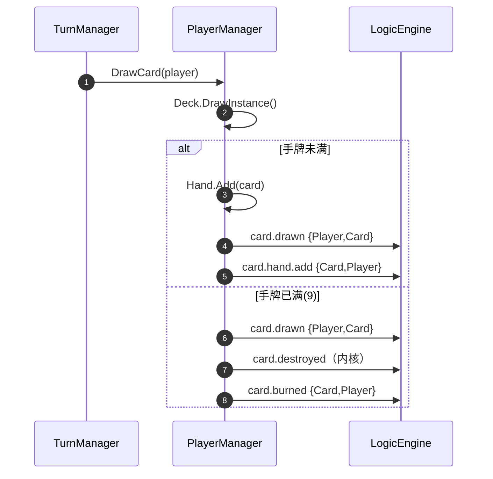

# 03 · 卡牌管理

> **覆盖**：⑤ 卡牌管理——加载（`card.load`）、抽牌、入手、爆牌、弃牌、回卡组、构筑外判定。
> **内容边界**：含卡牌在手/在库/销毁层的管理。**不含**：出牌打出链（→ [`04`](04-打出与部署.md)）、加载两段式组件细节（→ [`01`](01-对局初始化与终局.md) ⑱）、数值修饰（→ [`07`](07-修饰器与光环.md)）。
> **相关文件**：[`01`](01-对局初始化与终局.md)（加载装配）、[`04`](04-打出与部署.md)（出牌离手）、[`02`](02-回合与资源.md)（回合抽牌位）。

---

## ⑤ 卡牌管理

### 触发 / 前置
管理器：`PlayerManager`（抽/弃/回迁）、`CardBase.LoadAsync`（加载）。
手牌上限：`Player.HandLimit = 9`。

### 分步骤表

#### A. 加载（`CardBase.LoadAsync`）
| 步 | 代码位置 | 语义 | 信号 |
|---|---|---|---|
| 1 | `LoadDecksAsync` | 逐玩家×洗牌后序：`Instantiate` → `AttachInstanceAt` → `LoadAsync` | — |
| 2 | `CardBase.LoadAsync` | Owner → ID → 两段式组件 → 效果装载 | — |
| 3 | 同上 | 广播加载完成 | **`card.load`**（载荷 `{Card, Player}`） |

> 加载链末尾才发 `card.load`——消费者查不到"半就绪"状态。详见 [`01`](01-对局初始化与终局.md) ⑱。

#### B. 起手装载（`PlayerManager.LoadOpeningHand(player, count)`）
| 步 | 代码位置 | 语义 | 信号 |
|---|---|---|---|
| 1 | `DrawIntoHand` | `Deck.DrawInstance()` + `Hand.Add` | — |
| 2 | 同上 | **静默**（不经 `DrawCard`，**不发** `card.drawn`/`card.hand.add`；**不受**上限裁决） | 无 |

#### C. 抽牌（`PlayerManager.DrawCard(player, ct)`）
| 步 | 代码位置 | 语义 | 信号 |
|---|---|---|---|
| 1 | `DrawCard` | `card = Deck.DrawInstance()`（空库/未加载 → 抛错） | — |
| 2a | 未满手 | `Hand.Add(card)` | — |
| 2b | 未满手 | 先发抽牌、后发入手 | **`card.drawn`** → **`card.hand.add`** |
| 3 | 满手（`IsAtLimit`：`Hand.Count ≥ 9`） | `HandLimitBurn.BurnAsync(emitDrawn:true)` | **`card.drawn`** →（销毁）→ **`card.burned`** |
| 4 | 返回 | 返回卡引用（爆牌路径返回被爆卡） | — |

#### D. 爆牌（`HandLimitBurn.BurnAsync`）
| 步 | 代码位置 | 语义 | 信号 |
|---|---|---|---|
| 1 | `BurnAsync` | `emitDrawn==true` → 先发抽牌 | **`card.drawn`** |
| 2 | 同上 | `engine.DestroyCard(card)`（与弃置共用"销毁"） | `card.destroyed`（内核信号） |
| 3 | 同上 | 发爆牌 | **`card.burned`** |

> 爆牌**不走手牌**（直爆，手牌全程保持上限）、**不发 `card.hand.add`**、**不经弃置路线**（不发 `card.discarded`）。

#### E. 弃牌（`PlayerManager.DiscardCardAsync`）
| 步 | 代码位置 | 语义 | 信号 |
|---|---|---|---|
| 1 | `DiscardCardAsync` | `!Hand.Contains(card)` → **抛错**（归属口径＝卡当前所在手牌） | — |
| 2 | 同上 | `Hand.Remove(card)` | — |
| 3 | `DestroyAndEmitDiscardedAsync` | 先销毁、后发弃置 | `card.destroyed` → **`card.discarded`** |

#### F. 回卡组（`ReturnToDeckTop` / `ReturnToDeck`）
| 步 | 代码位置 | 语义 | 信号 |
|---|---|---|---|
| 1 | `ReturnToDeck(player, card, position)` | 校验：在手牌 ∧ `0 ≤ position ≤ Deck.Count` ∧ 不重复归属 ∧ 定义可解析 | — |
| 2 | 同上 | `Hand.Remove(card)` → `Deck.InsertInstanceAt(position, …)` | — |
| 3 | — | **静默**（不发任何信号） | 无 |

> `ReturnToDeckTop(player, card)` ＝ `ReturnToDeck(player, card, 0)`（0＝卡组顶/下次抽取取件端）。

#### G. 构筑外判定（`PlayerManager.IsOutsideDeck(card)`）
- 纯读：`card.MatchCardId > _cardIdWatermark`。水位线在加载完成后由 `SnapshotCardIdWatermark()` 固定。

### 时序图（主干 · 抽牌与爆牌分支）

### 关联效果预制体
`load_basic`（`card.load`）、`drawn_basic`（`card.drawn`）、`hand_add_basic`（`card.hand.add`）、`burn_basic`（`card.burned`）、`discard_basic`（`card.discarded`）、`destroy_basic`（`card.destroyed`）。

### 前端对接要点
- **抽牌两态**：正常＝`card.drawn`→`card.hand.add`；爆牌＝`card.drawn`→(销毁)→`card.burned`（**无** `card.hand.add`）。前端据"是否收到 `card.hand.add`"区分。
- 起手与回迁**静默**——不能用信号感知，需读 `Player.Hand`/`Player.Deck`。
- 弃牌与爆牌**都走 `engine.DestroyCard`**，但信号不同（`card.discarded` vs `card.burned`）；**爆牌不触发弃牌路线**。

### 能力现状
- **无疲劳**：空卡组抽牌直接抛错（kards-diy 的 fatigue 递减伤害未建模）。
- 起手装载不受手牌上限约束。
