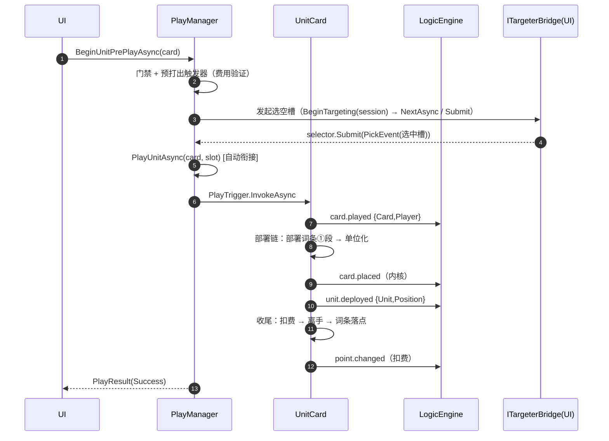

# 04 · 打出与部署

> **覆盖**：⑥ 单位打出＋部署（含加入路径）、⑦ 指令打出、⑧ 反制（激活↔取消）。
> **内容边界**：含打出链、部署链、加入链、指令施放、反制翻转。**不含**：选空槽/选目标交互实现（→ [`06`](06-目标选择（异步倒置）.md)）、部署词条效果内部（→ [`08`](08-效果体系.md)）、交战（→ [`05`](05-指挥与交战.md)）。
> **相关文件**：[`06`](06-目标选择（异步倒置）.md)（选槽交互）、[`05`](05-指挥与交战.md)（词条作用点）、[`08`](08-效果体系.md)（injects）、[`03`](03-卡牌管理.md)（抽弃）。

---

## ⑥ 单位打出＋部署

### 触发 / 前置
- 入口：`PlayManager.BeginUnitPrePlayAsync(card, ct)`（预打出，验证+选空槽，确认后自动衔接打出链）。
- 直接入口：`PlayManager.PlayUnitAsync(card, slot, ct)`（部署路径）、`PlayManager.JoinUnitAsync(card, slot, ct)`（加入路径）。
- 门禁：非终局 ∧ 归属已加载（否则 fail-fast 抛错）∧ 费用 ∧ 空槽候选非空。

### 分步骤表（`BeginUnitPrePlayAsync`）

| 步 | 代码位置 | 语义 | 结果 |
|---|---|---|---|
| ① | `PlayManager.BeginUnitPrePlayAsync` | 取归属（`RequireOwner`，缺 → 抛错） | — |
| ② | 同上 | 终局/相位门禁 | `Failure(GameEnded\|PhaseBlocked)` |
| ③ | 同上 | 开动作作用域 `BeginAction()` | — |
| ④ | `card.PrePlayTrigger.InvokeAsync` | 预打出触发器（内含费用验证 `validation.cost.check`） | 验证不足 → `Failure(PrePlayPointShortage)` |
| ⑤ | 同上 | 计算候选空槽 `GetAdjacentEmptySlots()`；空 → 拒绝 | `Failure(PrePlayNoAvailableSlots)` |
| ⑥ | `TargeterManager.RunAsync(flow)` | 发起选槽交互（桥接交付会话）；取消 → `Cancelled` | — |
| ⑦ | 同上 | 取选中槽（非 `Slot` → `TargetingFailed`） | — |
| ⑧ | `PlayManager.PlayUnitAsync(card, slot, ct)` | **确认后自动衔接部署路径** | `PlayResult` |

### 分步骤表（`PlayUnitAsync` — 部署路径）

| 步 | 代码位置 | 语义 |
|---|---|---|
| 1 | `PlayManager.PlayUnitAsync` | 门禁 + 槽须空（否则 `TargetSlotOccupied`）+ 未单位化（否则 `UnitAlreadyUnitized`） |
| 2 | 同上 | 开动作作用域；驱动 `card.PlayTrigger` |

#### 打出链（`UnitCard.HandlePlayChainAsync`，外层）
| 步 | 语义 | 信号 |
|---|---|---|
| ① | 校验载荷 | — |
| ② | 打牌 | **`card.played`**（`{Card, Player}`） |
| ③ | 内层部署链 `DeployTrigger`（若单位化失败 → 中断，**不进入收尾**：不扣费/不离手） | 见下 |
| ④ | 收尾：读有效部署费 → 扣费 → 离手 → 词条落点（闪击等） | `point.changed`（扣费），`player.Hand.Remove` |

#### 部署链（`UnitCard.HandleDeployChainAsync`，内层）
| 步 | 语义 | 信号 |
|---|---|---|
| ① | **部署词条效果** `InvokeDeployKeywordAsync`（触发「部署词条触发器」；无注入＝空转） | 效果自定 |
| ② | **单位化** `UnitizeTrigger`（挂组件+入槽）；中断 → 不发后续 | — |
| ③ | 放置 | **`card.placed`**（内核信号） |
| ④ | 部署完成 | **`unit.deployed`**（`{Unit, Position}`） |

> 单位化 `HandleUnitizeAsync`：`UnitStateData.CreateInitial` → 填类型 → 设位置 → `AddData` → `slot.Place` → 修饰基准快照 `RequestRerunAsync`。

### 分步骤表（`JoinUnitAsync` — 加入路径）

| 步 | 语义 | 信号 |
|---|---|---|
| 1 | 门禁 + 槽须空 + 未单位化（**不要求归属**） | — |
| 2 | `card.JoinTrigger` → 加入链 `HandleJoinChainAsync`：单位化 | — |
| 3 | 放置 | **`card.placed`** |
| 4 | 加入完成 | **`unit.joined`** |

> **部署 vs 加入**核心差异：部署发 `card.played`、走部署词条①段、扣费离手；加入**不发 `card.played`、不走部署词条、不扣费、不离手**。

### 时序图（主干 · 部署路径）

### 关联效果预制体
- `played_basic`（`card.played`）、`deploy_basic`（`unit.deployed`；`actorFrom=eventCard`）、`deploy_listener`（监听 `unit.deployed`）、`join_basic`（`unit.joined`）、`placed_basic`（`card.placed`）。
- **部署词条效果**经效果预制体 `injects` 注入**宿主具名触发器**「部署词条触发器」（见 [`08`](08-效果体系.md)）。

### 结果对象与门禁

| 结果 | 取值 |
|---|---|
| `PlayResultStatus` | `Success` / `Cancelled` / `Failed` |
| `PlayFailureReason` | `PrePlayPointShortage` / `PrePlayNoAvailableSlots` / `TargetingFailed` / `PlayVerificationRejected` / `PlayChainFault` / `TargetSlotOccupied` / `UnitAlreadyUnitized` / `GameEnded` / `PhaseBlocked` |

> 约定：判类别化枚举，不文本匹配；**拒绝/失败/取消＝零副作用**（不发更新、不推进状态）。

### 前端对接要点
- 单位出牌是**两步**：预打出（选槽交互）→ 自动衔接部署；UI 只需调 `BeginUnitPrePlayAsync`，引擎内部完成衔接。
- 播放顺序：`card.played` →（部署词条效果）→ `card.placed` → `unit.deployed` →（收尾）`point.changed`。
- 拖拽落点决定槽位；候选＝己方支援线**相邻空槽**。

### 能力现状
- 部署词条当前绑定词条：闪击 / 奋战 / 烟幕 / 伏击（见 [`05`](05-指挥与交战.md)）。

---

## ⑦ 指令打出

### 触发 / 前置
- 入口：`PlayManager.BeginCommandPrePlayAsync(card, ct)` 与 `PlayManager.PlayCommandAsync(card, ct)`（**同一实现**）。
- 门禁：同单位（非终局 ∧ 归属 ∧ 费用）。

### 分步骤表（`RunCommandChainAsync`）

| 步 | 语义 | 信号 |
|---|---|---|
| 1 | 门禁 + 开动作作用域 | — |
| 2 | **预打出段**：`card.PrePlayTrigger`（载荷含 `CaptureBox`） | 验证不足 → `Failure(PrePlayPointShortage)` |
| 3 | handler 请求取消（`captureBox.IsPrePlayCancelled`） | `Cancelled()`（零副作用） |
| 4 | **打出段**（确认后自动衔接）：`card.PlayTrigger` | **`card.played`** |
| 5 | 结果映射 | `PlayResult` |

> 指令默认**无交互、零更新**；交互（若有）由装配方 handler 经 `CaptureBox` 主动发起。指令效果经 `OrderFlow`（band `Counter/Resolve/Finalize`）施放。

### 关联效果预制体
- `played_basic`；指令效果经 `OrderFlow` 的 band（反制类效果注入 `Counter` band）。

### 前端对接要点
- 指令与单位共用"预打出→打出"结构，但指令**不必选槽**（除非效果要求选目标）。
- 指向性指令的选目标经 [`06`](06-目标选择（异步倒置）.md)。

### 能力现状
- 指令用的"指向性拖拽"在部分卡上仍依赖效果侧 handler 发起选靶。

---

## ⑧ 反制（激活↔取消）

### 触发 / 前置
- 入口：`PlayManager.UseCounterAsync(card, ct)`（仅己方回合）。
- 门禁：非终局 ∧ 己方回合 ∧ 费用；需有回合上下文（独立构造不支持）。

### 分步骤表

| 步 | 代码位置 | 语义 | 信号 |
|---|---|---|---|
| 1 | 前置判定 `card.UseCounterTrigger.EvaluateValidation(...)`（＝`validation.counter.use`） | 不合法 → `CounterNotOwnerTurn` / `CounterPointShortage` / `CounterRejected` | — |
| 2 | `card.UseCounterTrigger.InvokeAsync` | 驱动状态翻转（业务在 `CounterCard.HandleUseCounterAsync`） | — |
| 3a | **未激活 → 激活** | 读有效部署费 → 扣点 → 置激活 → 注册效果 handler | **`counter.triggered`** |
| 3b | **已激活 → 取消** | 按实扣额**无条件退点** → 清记录 → 取消激活 → 注销 handler | **不发信号** |

### 关联效果预制体
- `counter_basic`（`counter.triggered`）。

### 前端对接要点
- 反制是**状态翻转**（激活↔取消），非"一次性打牌"；激活后手牌内**武装**、取消则**解除**。
- **取消分支不发信号**——UI 需自行按调用结果（`PlayResult`）更新"武装/解除"表现。
- 验证判定器 `validation.counter.use` 被"入口预检"与"触发器验证"**共用同一判定源**——moding 改写两侧同步生效。

### 能力现状
- 反制触发的"挂起/打断型"（打断部署/指令）在引擎侧由效果/流程承载；kards 的 `targetedByOrder` 等监听为 `Deferred`（见主索引缺口表）。
