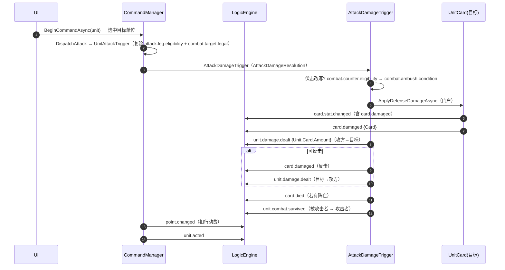
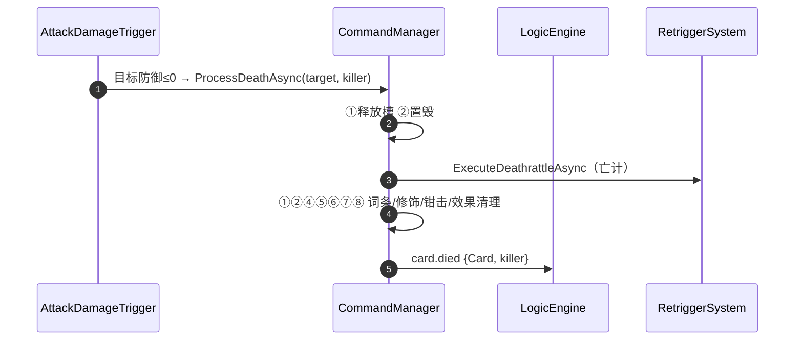

# 05 · 指挥与交战

> **覆盖**：⑨ 指挥/移动、⑩ 交战（攻击，含伏击改写/反击豁免）、⑪ 伤害（单位防御 / HQ 门户与管线）、⑫ 死亡（含离场/亡计）、⑬ 重触发（部署重放/亡计重发）、⑰ 关键词（闪击/奋战/烟幕/伏击 等）在各流程的作用点。
> **内容边界**：含移动、攻击、伤害、死亡、重触发与词条作用点。**不含**：选目标交互实现（→ [`06`](06-目标选择（异步倒置）.md)）、数值修饰链内部（→ [`07`](07-修饰器与光环.md)）、效果体系（→ [`08`](08-效果体系.md)）。
> **相关文件**：[`06`](06-目标选择（异步倒置）.md)、[`07`](07-修饰器与光环.md)、[`01`](01-对局初始化与终局.md)（判定器初始化）。

---

## ⑨ 指挥 / 移动

### 触发 / 前置
- 入口：`CommandManager.BeginCommandAsync(unit, ct, triggerCard?)`（**唯一公开拖拽入口**，内部分派移动/攻击）。
- 分按钮入口：`BeginMoveAsync` / `BeginAttackAsync`。
- 纯查询：`GetCommandAvailability(unit)`（无副作用、不发更新、不启动交互，可高频调用）。
- 门禁：非终局 ∧ 己方回合 ∧ 在场未死亡 ∧ 两动作之一可用。

### 分步骤表（拖拽）

| 步 | 代码位置 | 语义 |
|---|---|---|
| 1 | `BeginCommandAsync` | 门禁 → 发起判定 `GetCommandAvailability` → 不可用则 `Failure(...)` |
| 2 | 同上 | 开动作作用域 `BeginAction()` → `CommandTrigger.InvokeAsync` |
| 3 | `HandleCommandFlowAsync` | **复算**可用性 → 合并移动/攻击候选 → 交互 `targeter.Targeting()` |
| 4 | `DispatchSelectedAsync` | **分派**：选中敌方 HQ → 攻击；选中单位 → 攻击；选中空槽 → 移动；否则 `TargetingFailed` |

### 分步骤表（移动执行 · `DispatchMoveAsync` → `UnitMoveTrigger`）

| 步 | 代码位置 | 语义 | 信号 |
|---|---|---|---|
| 1 | `DispatchMoveAsync` | 组装 `Unit/OldPosition/NewPosition` → `UnitMoveTrigger.InvokeAsync` | — |
| 2 | `MoveRevalidationJudicator` | 复验：`validation.move.recheck` → `move.leg.eligibility` → 位置一致 → 目标须前线空槽 → `move.frontline-enemy` | — |
| 3 | `HandleUnitMoveAsync` | `oldSlot.Clear()` → `newSlot.Place(unit)` → `state.Position=newSlot` | **`unit.position.changed`**（`{Unit,OldPosition,NewPosition}`） |
| 4 | `FinalizeMoveAsync`（外层收尾） | `OperateCosts.DeductAsync`（扣行动费）→ `CanMove=false` → 非坦克 `CanAttack=false` | `point.changed`（扣费） |
| 5 | `DispatchMoveAsync` | 未阵亡则发行动完成 | **`unit.acted`** |

### 关联效果预制体
- `position_basic`（`unit.position.changed`）、`acted_basic`（`unit.acted`）。

### 前端对接要点
- **一次拖拽＝一次 `BeginCommandAsync`**；候选＝移动∪攻击并集（用 `GetCommandAvailability` 提前高亮/置黑）。
- `GetCommandAvailability` 是**纯查询**：拖拽前高频调用安全，不产段、不发更新。
- 顺序：`unit.position.changed` →（收尾）`point.changed` → `unit.acted`。

### 能力现状
- 缺独立公开 `MoveAsync`/`AttackAsync`（移动/攻击只能经拖拽链或直接 `Invoke` 流程触发器）——已由 `BeginMoveAsync`/`BeginAttackAsync` 提供分按钮形态。
- `LeaveBattlefieldAsync`（非死亡离场）**不发** `card.died`/`card.discarded`/`unit.position.changed`。

---

## ⑩ 交战（攻击）

### 触发 / 前置
- 由 `BeginCommandAsync`/`BeginAttackAsync` 分派；候选经 `combat.target.legal`（六重编排）筛选。

### 分步骤表

| 步 | 代码位置 | 语义 |
|---|---|---|
| 1 | `CollectAttackCandidates` / `DispatchAttackAsync` | 组装 `Attacker/Target` → `UnitAttackTrigger.InvokeAsync` |
| 2 | `AttackRevalidationJudicator` | 复验：`attack.leg.eligibility` → `combat.target.legal` |
| 3 | `HandleUnitAttackAsync` | **HQ 简路**：算攻值 → `Hq.ApplyDamageAsync` → `unit.damage.dealt`（**不反击**） |
| 4 | `HandleUnitAttackAsync` | **单位路径**：构造 `AttackDamageResolution` → `AttackDamageTrigger.InvokeAsync` |
| 5 | `KeywordRules.RecordAttack(attacker)` | 收尾记账 |
| 6 | `FinalizeAttackAsync`（外层收尾） | 扣行动费 → `CanAttack=ResolveCanAttackAfterAttack`（奋战记账）→ 非坦克 `CanMove=false` |
| 7 | `DispatchAttackAsync` | 未阵亡则发行动完成 |

### 「造成攻击伤害」链（`AttackDamageTrigger`）

1. **伏击改写 handler 先执行**（`AmbushKeywordComponent.HandleAttackDamageAsync`）：前置校验 → 先资格 `combat.counter.eligibility` → 后条件 `combat.ambush.condition` → `resolution.MarkRewritten()`。
2. **默认基础互伤 handler 后执行**（`HandleDefaultAttackDamageAsync`，优先级在后）：
   - 死亡冻结（尸体不结算）→ 若 `IsRewritten` 则（攻击者死 + 被攻击者 `unit.combat.survived`）返回；
   - 默认互伤：`ResolveIncomingDamage`（免疫归零 / 重甲减伤）→ `combat.counter.eligibility` 决定是否反击；
   - 目标侧 `ApplyDefenseDamageAsync` → `unit.damage.dealt`；反击方向（若有）→ `unit.damage.dealt`；
   - 死亡判定（`ProcessDeathAsync`，见 ⑫）；
   - `unit.combat.survived`：**被攻击者先、攻击者后**（仅未阵亡者）。

### 时序图（主干 · 单位互伤，目标存活）

### 关联效果预制体
- `attack_basic`（`injects` →「单位攻击触发器」）、`damaged_basic`、`damage_dealt_basic`、`combat_survived_basic`、`acted_basic`。

### 前端对接要点
- **攻击伤害不走内核 `AttackFlow`/`DamageFlow`**（那是引擎通用流程，供效果复用）；单位交战的**真源在 `CommandManager`**，伤害落在**防御**（`DefenseLoss`）而非 `Health`。
- 播反制/反击：看 `unit.damage.dealt` 的来源与 `unit.combat.survived`；**反击豁免**由 `combat.counter.eligibility` 决定（炮兵不受反击 / 轰炸机仅被战斗机反击 等）。
- ⚠ **观察序反直觉**：致死时 `card.died` 可能**先于**门户末尾的 `card.damaged` 出现（死亡由 `HandleDefenseDepletionAsync` 响应 `card.stat.changed` 触发）。前端勿用"先 damaged 后 died"的假设。

### 能力现状
- 交战子规则已落地判定器：`combat.target.legal`（六重）/ `combat.range` / `combat.guard.eligibility` / `combat.interception` / `combat.counter.eligibility` / `combat.ambush.condition`。
- kards 的 `attacked`（被攻击）/ `afterAttack` / `afterAttackHQ` / `friendlyAttacked` 等监听为 **`Deferred`**（待补）。

---

## ⑪ 伤害

### 触发 / 前置
- 单位：`UnitCard.ApplyDefenseDamageAsync(amount, ct)`（门户，唯一改写入口）。
- HQ：`Hq.ApplyDamageAsync(amount, ct)`（毒/伤统一路径）。

### 分步骤表（单位防御伤害）

| 步 | 代码位置 | 语义 | 信号 |
|---|---|---|---|
| 1 | `ApplyDefenseDamageAsync` | 记 `defenseBefore` → `state.DefenseLoss += amount` | — |
| 2 | 同上 | 动员 `MobilizeRules.OnUnitDamagedAsync` | — |
| 3 | 同上 | `Modifiers.RequestRerunAsync`（跑链 → 集中触发） | **`card.stat.changed`** |
| 4 | 同上 | 防御实际变化才发受伤 | **`card.damaged`**（`{Card}`） |

> **护甲/减伤**在交战侧由 `ResolveIncomingDamage` 完成（免疫归零 / 重甲减伤下限 0），在默认互伤 handler 之前登记到 `AttackDamageResolution`。

### 分步骤表（HQ 伤害）

| 步 | 代码位置 | 语义 | 信号 |
|---|---|---|---|
| 1 | `Hq.ApplyDamageAsync` | ①伤害改写段（`AddDamageRewriter` 链） | — |
| 2 | 同上 | ②致命介入（`AddLethalIntervention`） | — |
| 3 | 同上 | ③应用 `state.Health += adjustment - rewritten` | — |
| 4 | 同上 | ④`Modifiers.RequestRerunAsync` + 发受伤 | **`card.stat.changed`** → **`card.damaged`** |

> HQ 归零 → 终局由被动触发器 `HqZeroTrigger` 响应 `card.stat.changed` → `Hq.RespondToZero()`（**不内联在攻击流程**）。

### 关联效果预制体
- `damaged_basic`（`card.damaged`）、`stat_basic`（`card.stat.changed`）。

### 前端对接要点
- 受击表现消费 `card.damaged`（**不是** `card.stat.changed`——后者是"任一字段变化"）。
- HQ 伤害也走 `card.damaged`（载荷为 HQ 实体）。

### 能力现状
- 护甲 / 免疫 / 压制 / 动员 / 钳击 / 情报 / 老兵 等词条组件存在（`KeywordComponents*.cs`），作用时机见 ⑰。

---

## ⑫ 死亡

### 触发 / 前置
- 路径：`ProcessDeathAsync(unit, killer)`（由防御归零 `HandleDefenseDepletionAsync` 或攻击判定触发）。
- 包装入口：`CommandManager.KillUnitAsync`（`internal`）。

### 分步骤表（`ProcessDeathAsync`）

| 序 | 代码位置 | 语义 |
|---|---|---|
| ① | `state.Position?.Clear()` | 槽位释放 |
| ② | `state.IsDestroyed = true` | 置毁 |
| ③ | `RetriggerSystem.ExecuteDeathrattleAsync`（无服务则降级 `DeathrattleRules.ExecuteAsync`） | **亡计结算** |
| ④ | `KeywordRules.RevokeAllOnDeath` | 词条死亡注销 |
| ⑤ | `Modifiers.ClearAllForDeathAsync` | 修饰器清理（期限订阅随销） |
| ⑥ | `PincerRules.OnUnitLeftBattlefieldAsync` | 钳击失效通知 |
| ⑦ | `unit.RemoveEffect(...)` | 效果卸载 |
| ⑧ | `state.Position = null` | 位置字段置空 |
| ⑨ | `GameUpdates.EmitCardDied(...)` | **`card.died`**（`{Card}`，带 `killer`；恰一次） |

### 时序图（主干 · 死亡与亡计）

### 关联效果预制体
- `death_basic`（`card.died`）、`killed_basic`（击杀视角 `card.died`）、`combat_survived_basic`。

### 前端对接要点
- `card.died` 是死亡**唯一完成信号**（清理完毕后才发）；载荷带 `killer`（击杀者）。
- 亡计效果在 `card.died` **之前**结算（③ 在 ⑨ 之前）。

### 能力现状
- kards 的 `friendlyDeath` / `enemyKilled` / `afterKill` 等为 **`Deferred`**；`friendlySurvived` 为 **`NotPlanned`**。

---

## ⑬ 重触发（部署重放 / 亡计重发）

### 触发 / 前置
- 入口：`RetriggerSystem.RequestAsync(target, chain, ct)`、`RetriggerRules.RequestDeployAsync(target, ct)`、`RetriggerRules.RequestDeathrattleAsync(target, ct)`。
- 门禁：目标在场（重入防护）。

### 分步骤表

| 步 | 代码位置 | 语义 |
|---|---|---|
| 1 | `RetriggerSystem.RequestAsync` | 终局门禁 → 总线 `retrigger.request` → `HandleRequestAsync` 调度 |
| 2 | 部署重放 | **直接再调同一部署触发器**（定向，不发射链级信号） |
| 3 | 亡计重发 | `ExecuteDeathrattleAsync` → `DeathrattleRules.ExecuteAsync`（异常隔离、重入防护） |

### 前端对接要点
- 部署**重放**不重新发 `card.played`（定向再触发同一触发器）。
- 亡计是死亡流程 ③ 的**单源**；重发亡计 ≠ 再次死亡（不发新 `card.died`）。

### 能力现状
- 重入防护已内置（目标不在场＝拒绝）。

---

## ⑰ 关键词在各流程的作用点

| 词条（`KeywordSystem` 常量） | 类型 | 作用流程 / 位置 |
|---|---|---|
| 闪击 `Blitz` | 能力型 | **部署链收尾**（扣费后）置单位可移动+可攻击 |
| 奋战 `Fury` | 能力型 | **攻击收尾** `ResolveCanAttackAfterAttack`：首次攻击后仍可攻、二次后不可（次数词条组件自维护） |
| 烟幕 `SmokeScreen` | 标记型 | **攻击选靶**（`combat.target.legal`）中被筛除、不入候选 |
| 伏击 `Ambush` | 能力型 | **「造成攻击伤害」内改写**：被攻击单位实时攻击力 > 攻击者实时防御力 → 攻击者死亡、被攻击者不受伤（`combat.ambush.condition`） |
| 压制 `Suppressed` | 组件 | 词条组件存在；对应 kards 监听 `friendlySuppressed` 为 `NotPlanned` |
| 动员 `Mobilize` | 组件 | 受伤时 `MobilizeRules.OnUnitDamagedAsync` |
| 钳击 `Pincer` | 组件 | 离场/死亡时 `PincerRules.OnUnitLeftBattlefieldAsync` |
| 护甲 `Armor` | 组件 | 伤害减免（`ResolveIncomingDamage`） |
| 情报 `Intelligence` | 组件 | 存在（作用点见 `08`） |
| 免疫 `Immune` | 组件 | 伤害归零（`ResolveIncomingDamage`） |
| 亡计 `Deathrattle` | 能力型 | 死亡流程 ③（`ExecuteDeathrattleAsync`） |

### 前端对接要点
- 烟幕是**选靶侧过滤**（不产生独立信号）——不要在信号层期待"烟幕"事件。
- 伏击改写会让"攻击者死、被攻击者活"，与默认互伤方向相反——UI 需按 `unit.combat.survived` 的**对象**判方向。

### 能力现状
- 缺口（`GameHooks.PendingTriggers`）：`NotPlanned`＝`friendlyPinned`/`friendlySuppressed`/`friendlySilenced`/`friendlyRetreated`/`friendlySurvived`/`unpinned`/`impactUsed`/`chargeNow`；`Deferred`＝`unitMobilized`/`attacked`/`afterAttack`/`afterAttackHQ`/`friendlyDeath`/`friendlyAttacked`/`friendlyDamaged`/`hqDamaged`/`enemyKilled`/`afterKill`/`targetedByOrder`/`kreditsGained`/`unitLeft`。
- **跨层已知缺口**（前端 `HANDOVER.md`）：钳击配对关系在 `internal` 边界内，桥接层读不到；支援线仅 HQ 占位槽有视图。
