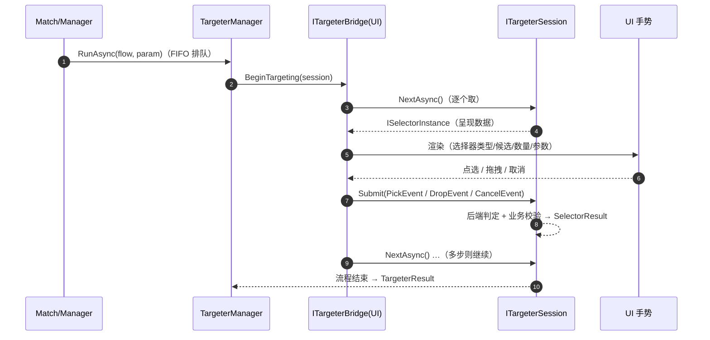

# 06 · 目标选择（异步倒置）

> **覆盖**：⑭ 目标选择——引擎向 UI 索取选择的统一形态（对应 kards-diy 的 `chooser`/`KG.ask`）。
> **内容边界**：含 targeter 发起、选择器契约、会话与结果三态。**不含**：谁发起选靶（→ [`04`](04-打出与部署.md)/[`05`](05-指挥与交战.md)）、候选的业务规则（见各流程判定器）。
> **相关文件**：[`04`](04-打出与部署.md)（选空槽）、[`05`](05-指挥与交战.md)（选攻击目标）、[`01`](01-对局初始化与终局.md)（换牌专用选择器）。

---

## ⑭ 目标选择（异步倒置）

### 触发 / 前置
- 引擎在某动作执行中需要玩家选择时，经 `TargeterManager.RunAsync(flow, param)` 发起；**UI 必须实现并注入 `ITargeterBridge`**（`Match` 构造时传入），否则以失败结局暴露（`TargeterFailureReason.BridgeNotAssembled`，不抛）。

### 分步骤表（引擎侧发起 → UI 应答）

| 步 | 代码位置 | 语义 |
|---|---|---|
| 1 | `TargeterManager.RunAsync(flow, param)` | 发起（入 FIFO 队列）；`flow` 内以 `ITargeterFlow.Step(selector, parameter)` 声明选择点 |
| 2 | `ITargeterBridge.BeginTargeting(session)` | 桥接交付**会话**（`ITargeterSession`） |
| 3 | `ITargeterSession.NextAsync()` | 前端按队列逐个取**选择器实例**（`ISelectorInstance`；返回 `null`＝流程结束） |
| 4 | `ISelectorInstance.Submit(selectorEvent)` | 前端把手势归一为**语义事件**（`PickEvent`/`DropEvent`/`CancelEvent`）提交；判定与校验归后端 |
| 5 | `ITargeterFlow.Retry()` | 组装方在流程内可选：非法选择＝同一选择器重入（有上限） |
| 6 | `ITargeterSession.Result` | 流程结束后读终局（`Ok`/`Cancelled`/`Failed`） |

### 结果契约

| 类型 | 三态 |
|---|---|
| `SelectorResult<TResult>` | `Ok(T)` / `Cancelled` / `Failed(reason)` |
| `TargeterResult` | `Ok` / `Cancelled` / `Failed(reason)`（产出已由流程内部消费/回写） |

**关键契约**：
- **逐个取用**：一次 targeter 可含多个选择器（多步流程）；前端 `NextAsync()` 逐个取、逐个完成（不再"一次 Begin 完成全部槽位"）。
- **语义事件**：前端只"采集/归一"手势，不判定；判定（取消/非法）与业务校验都在后端选择器实例内。
- **空提交**：拖拽型（落空）＝取消；点选型＝`Failed(InvalidSelection)`；`min=0` 的多选允许空选＝`Ok`（空）。
- **重试**：`flow.Retry()` 使**同一选择器实例**（同一 `Id`）再次交付前端；超上限`＝Failed(RetryLimitExceeded)`。
- **取消**：某选择器取消 → 组装方据 `SelectorResult` 决定（当前实现＝传播为 targeter 级 `Cancelled`，使用者据此撤销本次放置/打出）。
- **排队串行**：`TargeterManager` 是全局 FIFO 串行队列，一次只执行一个 targeter（并发＝排队）。
- **候选由后端给出**：前端不再提交"完整可交互引用列表"（候选收集已退场）。

### 时序图

### 关联效果预制体
- 无独立模板；目标选择由流程组装方（引擎流程或效果 handler）按需发起。

### 前端对接要点
- **必须实现 `ITargeterBridge` 并注入**；`BeginTargeting` 内不要阻塞（把会话挂到 UI 交互循环）。
- 循环写法：`while (await session.NextAsync() is { } selector) { 呈现(selector.Presentation); 提交; }`，随后读 `session.Result`。
- **选择器类型名**（`SelectorPresentation.SelectorName`）用于选择视觉实现；候选由后端给出。
- 同一选择器 `Id` 再次出现＝**重入**（非法选择后重选），可提示"选择无效，请重选"。
- 换成"取消"的两种表达：点选型＝取消按钮（`CancelEvent`）；拖拽型＝松手/触点在屏外（落空）。

### 能力现状
- **专门选择器族**（`SelectorNames`）：`fieldUnit`、`handOrigin`、`unitHandDrag`、`afterPlacement`、`slot`、`targetPoint`、`hand`、`mulligan`、`option`、`cardPicker`、`cardPickerReference`。
- **模板**（`SelectorTemplates`）：进程内共用、无运行期身份；组装 targeter 时引用模板或以参数组装。
