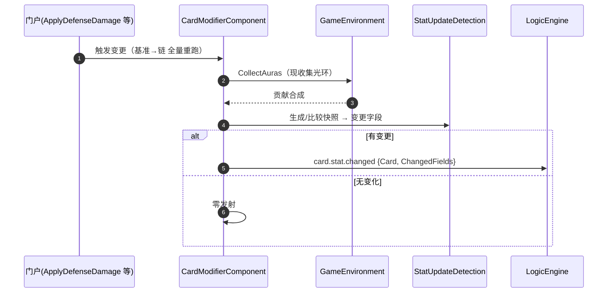

# 07 · 修饰器与光环

> **覆盖**：⑯ 修饰器 / 修饰链 / 光环 / 期限 / 更新检测 / 集中触发（`card.stat.changed`）。
> **内容边界**：含数值变换的链式重跑与变更检测。**不含**：伤害/死亡的业务编排（→ [`05`](05-指挥与交战.md)）、效果如何挂修饰器（→ [`08`](08-效果体系.md)）。
> **相关文件**：[`05`](05-指挥与交战.md)（伤害门户）、[`08`](08-效果体系.md)（效果装载）、[`01`](01-对局初始化与终局.md)（GameEnvironment 装配）。

---

## ⑯ 修饰器与光环

### 概念速览（`CONTEXT.md` 口径）

| 术语 | 含义 |
|---|---|
| 修饰器（Modifier） | 挂到卡牌、参与链式重跑的值变换单元（加/设值/回调/引用/钳制/条件） |
| 修饰链（链） | 每轮从基准**全量重跑**的确定变换（基准→链→有效值），有效值缓存供读 |
| 光环（Aura） | 非本地来源的持续贡献；受益侧重跑时**现收集**、过滤、合成 |
| 期限 | 修饰生效时长（"直到回合结束"等）；到期订阅相位面自注销 |
| 更新检测接口 | 组件级变更检测面（生成/比较快照），识别"哪些字段变了" |
| 集中触发 | 一轮全部变更合并为**一次** `card.stat.changed`（有变更才发、无变化零发射） |

### 触发 / 前置
- 数值变化的**受控入口**＝门户：`UnitCard.ApplyDefenseDamageAsync` / `FactionCostData` 等；改写/介入在链上挂。
- 全域重跑：`GameEnvironment.RerunAllCardsAsync`（关系变化随动）。

### 分步骤表（一次数值变更）

| 步 | 代码位置 | 语义 |
|---|---|---|
| 1 | 门户入口（如 `ApplyDefenseDamageAsync`） | 触发一次变更请求 |
| 2 | `CardModifierComponent`（链/检测/管线载体） | 从**基准**起**全量重跑**修饰链 |
| 3 | `GameEnvironment.CollectAuras(...)` | **现收集**光环贡献 → 过滤 → 合成 |
| 4 | 链产出有效值 → 写缓存 | 供读取 |
| 5 | `StatUpdateDetection` 更新检测接口 | 生成/比较快照，识别变更字段 |
| 6 | `GameUpdates.EmitCardStatChanged` | **集中触发**（有变更才发） |

### 信号

| 信号 | 载荷 | 说明 |
|---|---|---|
| `card.stat.changed` | `{Card, ChangedFields}` | 一轮变更合并为**一次**；`ChangedFields` 指出哪些字段变了 |

> 无变化 → **零发射**（P1：禁止无条件数据更新）。

### 期限到期
- `ModifierExpiry` 自订阅**相位面**（如回合开始/结束），到点**自注销**；链全量重跑即回原值（无需单独"撤销"）。

### 光环随动
- 相邻/前线等**关系**变化 → `RerunAllCardsAsync`（全域重跑）→ 受益单位重跑时现收集，光环收益随动。

### 时序图（主干）

### 前端对接要点
- **不要**把 `card.stat.changed` 当成"具体伤害"——它是**任一字段变化**的合并通知；伤害请消费 `card.damaged`，攻防数值刷新用 `card.stat.changed`。
- **有变化才发**：空动作不发信号、不产段。
- 期限到期、光环关系变化**都**收敛到 `card.stat.changed`（无需额外信号）。

### 能力现状
- 修饰器/修饰链/光环/期限/更新检测/集中触发均已落地（`ModifierSystem` / `AuraSystem` / `GameEnvironment` / `StatUpdateDetection`）。
