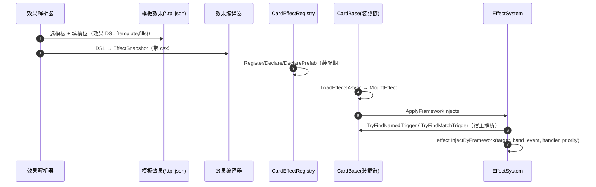

# 08 · 效果体系（DSL / 模板 / 预制体 / 装载链 / injects）

> **覆盖**：效果初始化与效果体系——效果 DSL、模板效果、效果预制体、装载链、`injects` 落地。对接主索引"效果预制体总表"。
> **内容边界**：含"卡面文本/声明 → 可跑效果 → 注入流程位"的闭环。**不含**：各流程的业务编排（见 [`01`](01-对局初始化与终局.md)–[`07`](07-修饰器与光环.md)）、词条组件内部（→ [`05`](05-指挥与交战.md)）。
> **相关文件**：[`04`](04-打出与部署.md)（部署词条注入）、[`05`](05-指挥与交战.md)（攻击 band）、[`01`](01-对局初始化与终局.md) ⑱。

---

## 效果体系总述

四层结构（`CONTEXT.md` 口径）：

| 层 | 形态 | 说明 |
|---|---|---|
| **效果 DSL** | `{ template, fills }` | 效果解析器的独立可序列化中间层；引用模板效果并给槽位填 op 序列（官方带参原语 + `csx` 逃生舱） |
| **模板效果**（Template effect） | `*.tpl.json` | 为效果解析器设计的专用预制体格式（与 `EffectSnapshot` 同构子集）+ 显式 **handler 槽位声明**（语义槽位名定位到事件 id） |
| **效果预制体**（Effect prefab） | `EffectSnapshot` / `*.prefab.json` | 运行期效果快照；程序集来源或本地目录来源 |
| **效果实例**（Effect） | `Effect` 子类实例 | 装载到卡上；`OnMount`/`OnUnmount` 生命周期；可 `Inject`/`CastAsync` |

> **解析器**（"卡面中文 → 词法层 → AST → 效果 DSL"）表达力为引擎表达力的**显式子集**；超子集＝**显式失败 + 诊断**（不产占位效果）。双口径：**结构覆盖率**（能译成 DSL 并编译真 csx）与**语义完整覆盖率**（无占位条件、无 `needsCsx`/`csx`，即直接可跑）**必须同时报**。

---

## 装配期（效果初始化）

| 步 | 代码位置 | 语义 |
|---|---|---|
| 1 | `CardEffectRegistry.Register(effectId, factory)` | 登记效果工厂（注册即配置、重复拒绝） |
| 2 | `CardEffectRegistry.Declare(cardId, effectIds)` / `DeclarePrefab(cardId, prefabIds)` | 声明"某卡挂哪些效果/预制体" |
| 3 | `LogicEngine.RegisterCardMountCompletedAction(...)` | 装载管线扩展点（`Match.Initialize` 注册装载完成动作） |
| 4 | `PrefabManager.RegisterHandler/RegisterPrefab/LoadDirectory` | 预制体来源：程序集注册 / csx / `*.prefab.json` 目录（只扫顶层、按文件名序、单文件失败隔离） |
| 5 | `LogicEngine.ScriptEvaluator = IScriptEvaluator` | csx 求值器（宿主未装配则用默认 `CSharpScriptEvaluator`） |

---

## 装载链（卡加载时）

| 步 | 代码位置 | 语义 |
|---|---|---|
| 1 | `CardBase.LoadEffectsAsync` | 按声明把效果实例挂到卡上 |
| 2 | `CardLoadout.MountEffect` | 挂主触发器 → `effect.OnMount` → 装载完成动作 |
| 3 | 效果 `Inject<TView>(target, band, event, priority)` | 注入流程触发器具名 band（卸载自动撤销） |
| 4 | `EffectSnapshot.BuildLoadPlan` → `EffectLoadStepKind.Inject` | 预制体的注入步骤 |

---

## injects 落地（效果 → 流程位）

**声明**：模板效果的 `injects` 条目（`{ target, band, event, priority }`，本版 `band` 非空不支持、仅默认区段）→ 编译为 `InjectPrefab`。

**宿主解析**（`EffectSystem.ApplyFrameworkInjects`）：

| 步 | 语义 |
|---|---|
| 1 | 须为**动态被动效果** |
| 2 | 按名解析宿主具名触发器：`card.TryFindNamedTrigger(target, viewType)` |
| 3 | 未命中 → 回退**对局级**具名触发器：`TryFindMatchTrigger(target, viewType)` |
| 4 | 取事件 handler → `effect.InjectByFramework(target, viewType, eventId, handler, priority)` |
| 5 | 装载计划步骤 `EffectLoadStepKind.Inject` |

### 具名触发器登记面

| 层 | 名称（`RegisterNamedTrigger` / `MatchNamedTriggers.Register`） |
|---|---|
| **卡的具名触发器**（`UnitCard`） | 打出触发器 / 部署触发器 / **部署词条触发器** / 加入触发器 / 单位化触发器 |
| **对局级具名触发器**（`MatchNamedTriggers`，回退） | 指挥触发器 / 单位移动触发器 / 单位攻击触发器 / 造成攻击伤害触发器 |

### 模板效果 → 流程位（节选；完整表见主索引 §5）

| 模板 id | 监听 hook / inject 目标 |
|---|---|
| `played_basic` | `card.played` |
| `deploy_basic` | `unit.deployed`（`actorFrom=eventCard`） |
| `attack_basic` | **inject → 单位攻击触发器** |
| `damaged_basic` | `card.damaged` |
| `death_basic` / `killed_basic` | `card.died` |
| `counter_basic` | `counter.triggered` |
| `slot_gained_basic` / `slot_lost_basic` | `slot.gained` / `slot.lost` |

> 真源：`EffectParsing/Templates/*.tpl.json`（29 个）。

---

## 时序图（卡面文本 → 可跑效果）

---

## 前端对接要点
- 效果体系是**纯引擎内部**流水线，UI **无直接 API 面**（`HANDOVER.md` 已确认）。
- UI 只需消费效果**产生的信号**（见各流程）；无需感知 DSL/模板/prefab。
- 若排查"某卡效果为何不生效"：确认 ① `effectRegistry` 是否装配 ② 卡的 `Declare`/`DeclarePrefab` ③ 模板 `injects` 宿主名是否能解析（卡具名触发器 → 对局级回退）。

## 能力现状
- 表达力为**显式子集**；不可解析＝显式失败 + 诊断（`needsCsx` 留痕 / `if(false)` 占位条件），不静默丢弃。
