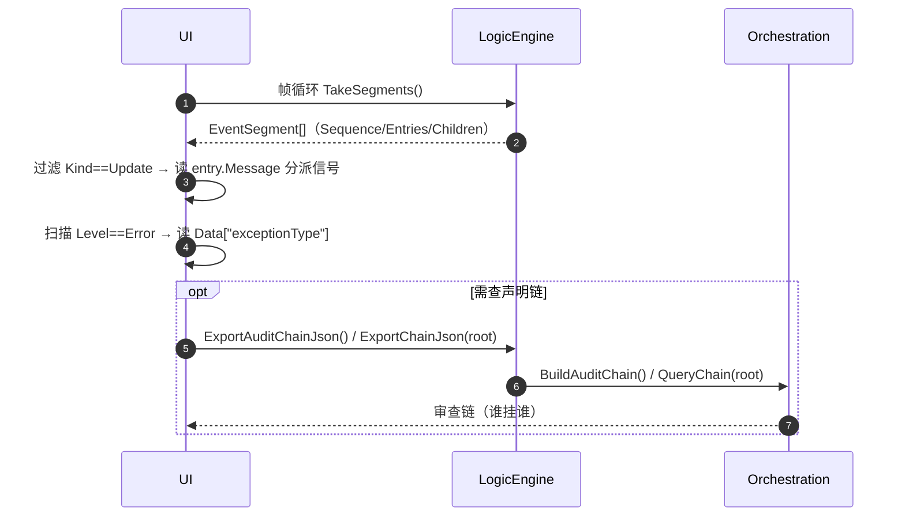

# 09 · 调试工具（事件流日志 / 触发器快照）

> **覆盖**：⑲ 调试工具——事件流段结构、报错消费、审查链/快照导出。含**内核面（`src/Orc`）**标注。
> **内容边界**：含"如何读段/如何导出审查链"。**不含**：各业务信号含义（见 [`01`](01-对局初始化与终局.md)–[`08`](08-效果体系.md)）。
> **相关文件**：全部流程文件（调试对象）；[`0X`] 段消费见主索引 §0 与既有 `ui-开发者交接文档.md`。

---

## ⑲ 调试工具

### A. 事件流段（观察面 · 拉取）

| API | 签名 | 说明 |
|---|---|---|
| `LogicEngine.TakeSegments()` | `IReadOnlyList<EventSegment>` | 取走全部待取段（FIFO、取走即移除、**无上限**） |
| `LogicEngine.TryTakeSegment(out seg)` | `bool` | 取走一段 |
| `LogicEngine.BeginAction()` | `ActionScope`（`await using`） | 开一次动作作用域（游戏层入口已包载，**通常无需 UI 直接调**） |

**段结构**：

```
EventSegment
├─ Sequence   : long                      // 段号（实例内单调递增，自 1 起）
├─ Timestamp  : DateTimeOffset            // UTC
├─ Entries    : IReadOnlyList<LogEntry>   // 本段全部条目（含冒泡；写入时序；含报错）
└─ Children   : IReadOnlyList<EventStream>// 本段新增的顶层子树（递归因果）

LogEntry
├─ Kind      : Update | Log | Attach
├─ Timestamp : DateTimeOffset
├─ Level     : Debug | Info | Warning | Error
├─ Source    : string                     // update 条目恒为 "bus"
├─ Message   : string                     // update 条目＝信号名字面值（如 "card.played"）
├─ Keywords  : IReadOnlyList<string>      // update＝[信号名]；报错含 "exception:{类型名}"
└─ Data      : IReadOnlyDictionary<string, object?>
```

- **可播放事件** ＝ `Kind == Update` 的条目；信号名读 `entry.Message`（**不是** `Source`）。
- **因果** ＝ `Kind == Attach` 的条目与 `Children` 子树。

### B. 报错消费
- 报错**随段交付**，无需另订阅：识别 `Level == Error`（或 `Keywords` 含 `exception:`）；`Data["exceptionType"]`/`Data["message"]` 为结构化信息。

### C. 更新总线 / hook 注册表（内核面）

| 面 | 代码位置 | 说明 |
|---|---|---|
| `LogicEngine.Hooks` | `Orc/Core/LogicEngine.cs` | hook 名 ↔ `HookId` 开放集合（构造期预登记 4 个内置更新） |
| `HookRegistry.Register/TryGetId/TryGetName/Names/Collisions` | `Orc/Core/HookRegistry.cs` | hook 词表 |
| `Bus.Mount/UnmountOwner/Emit/GetSubscribers/EnumerateHooks` | `Orc/Core/Bus.cs` | 订阅/派发（挂载优先级升序 → 注册序） |
| `Orchestration.Register/TriggersWithHook/TriggersWithKey/BuildAuditChain/QueryChain` | `Orc/Core/Orchestration.cs` | 声明期编排/审查链 |

### D. 快照 / 审查链导出（内核面 · `Orc.Output`）

| API | 说明 |
|---|---|
| `LogicEngine.ExportAuditChainJson(indented)` | 全域审查链 JSON（节点＝触发器种类，含实例清单与声明的下游边） |
| `LogicEngine.ExportAuditChainText()` | 全域审查链文本视图（与 JSON 同源） |
| `LogicEngine.ExportChainJson(root)` | 以指定触发器种类为起点的可达链 JSON |
| `Orc.Output.EventSegmentJson.Serialize(...)` | 段 → JSON |
| `Orc.Output.EventStreamJson.Serialize(...)` | 事件流（树）→ JSON |
| `Orc.Output.SnapshotJson.Serialize(...)` | 对局快照 → JSON |
| `Orc.Output.AuditChainJson/Text.Serialize(...)` | 审查链序列化 |

### 时序图（排查一次动作）



### 前端对接要点
- **帧循环必须持续 `TakeSegments()`**（段无上限、引擎不等 UI）；漏取 = 积压。
- 报错**随段来**，在段内扫 `Level==Error` 即可。
- **即时口不含框架留痕**（`log`/`attach` 只在段里出现）；即时口只发业务更新。
- 排查"某信号为何不发"：① 是否被门禁拒（零发射）② 是否无变化（P1 零发射）③ 用审查链确认触发器/hook 是否登记。

### 能力现状
- 审查链/快照导出为**内核面**，游戏层未再包装；UI 经 `Match.Engine` 可达。
