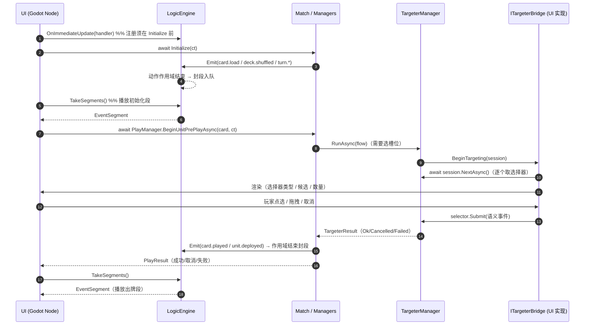

# UI 开发者交接文档 — 接入 OrC 引擎（消费 · 监听 · 输入）

> 受众：**Godot C# 前端开发者**（同进程同语言）。
> 用途：交接「UI 如何与 OrC 引擎对接」的全貌——**①消费事件流段 ②注册 handler 监听即时更新 ③集成 UI 输入**。
> 状态：与实现对齐（`BeginAction` / `TakeSegments` / `TryTakeSegment` / `OnImmediateUpdate`）；日期：2026-10-05。
> 边界：本文档只讲**宿主（UI）侧如何用引擎公开面**。联网/跨机引用（统一引用）、表现编排元数据等不在本文档范围。

---

## 0. 一句话模型

引擎每完成一次**动作**（打出一张牌、结束回合、指挥移动……），会把这次动作产生的**一"段"事件流**放进一个队列；**UI 在自己的帧循环里轮询取段、异步播放**。同时，UI 可**注册一个非阻塞 handler**，引擎在每次更新广播时回调它，用于**即时反馈**。UI 的**输入**（点击出牌、拖拽移动、选目标）通过 `Match` 上的管理器调用引擎动作入口；当引擎需要玩家做**目标选择**时，会**反过来**经桥接向 UI 要，UI 应答后才继续。

**三条主线的定位：**

| 主线 | 方向 | 用途 | 谁主动 |
|---|---|---|---|
| 事件流消费（段轮询） | 引擎 → UI | 播放完整视觉表现 | UI 主动拉取 |
| 即时更新监听 | 引擎 → UI | 即时反馈（音效/提示） | 引擎回调 UI |
| UI 输入集成 | UI → 引擎（含引擎反向索取） | 出牌 / 指挥 / 选目标 / 结束回合 | UI 主动调用；选择时倒置 |

---

## 0.1 术语速览

| 术语 | 含义（权威定义见根 `CONTEXT.md`） |
|---|---|
| **事件流段（段）** | 一次动作作用域内产生的引擎内部信号的聚合；引擎在动作结束时产出的自包含单元，供 UI 轮询消费。 |
| **段轮询（拉取）** | UI 主动从待取段队列取段；不依赖引擎精确通知。 |
| **即时更新监听** | UI 注册的非阻塞 handler；引擎在更新广播时点调用，用于即时反馈。 |
| **接入点 / 观察面 / 扩展点** | 三类 hook 概念：介入位置 / 只读进展获取 / 装配期注入面。**本文档三主线中**：段轮询与即时监听属**观察面**；输入集成属**动作入口**（非"接入点"）。 |
| **Hook** | 内核窄义词——"触发器构造期声明的要挂载到的更新字符串"。**不得**用它指代本文档的观察面/接入点/扩展点。 |

---

## 1. 通用接入骨架（先搭这三步）

### 1.1 取得引擎

对局的 `LogicEngine` 由 `Match` 持有并公开：

```csharp
// 构造对局（准备态）。桥接 targeterBridge 必须由 UI 侧传入，
// 否则引擎向 UI 索取目标时会以「失败结局」暴露（不抛）。
var match = new Match(
    deckForPlayerA, deckForPlayerB, cardDefinitions,
    targeterBridge: myBridge,      // UI 实现 ITargeterBridge
    // 其余可选：effectRegistry / deploymentLogicRegistry / deckConfig... / judicatorAssembly
);

LogicEngine engine = match.Engine;   // ①段轮询 与 ②即时监听 都经它
```

### 1.2 注册时机：**必须在 `Initialize` 之前**

初始化过程中的 `card.load` / `deck.shuffled` / 回合五连等更新会**经即时更新口发出**，并作为**一段**入队。若在 `await match.Initialize(ct)` 之后才注册/循环，就会错过初始化这一段。

```csharp
public void Attach(Match match)
{
    _match = match;
    _engine = match.Engine;

    // ②即时更新监听：非阻塞 handler（详见 §3）
    _immediateSub = _engine.OnImmediateUpdate((updateType, payload) =>
    {
        _pendingImmediate.Enqueue(updateType);   // 只入队，不耗时
    });
}

public async Task StartAsync(CancellationToken ct)
{
    await _match.Initialize(ct);   // 初始化＝一次大动作：结束时产出一段（含全部初始化信号）
    // ①段轮询在第 2 步的帧循环里做
}
```

### 1.3 帧循环与生命周期

```csharp
public override void _Process(double delta)
{
    foreach (var seg in _engine.TakeSegments())   // ①取走即移除
        _playback.Enqueue(seg);
    AdvancePlayback(delta);                       // 异步播放（引擎不等你，见 §2.5）
}

public override void _ExitTree() => _immediateSub?.Dispose();   // ②幂等取消
```

---

## 2. 【重点一】事件流消费（段轮询）

### 2.1 模型与两条 UI 通道

引擎内部一切因果都写入**事件流（树）**。UI 消费的是**一段**：引擎在**动作作用域**结束点（最外层）封段并**入待取队列**（FIFO、取走即移除、**无上限**）。

| 通道 | 引擎侧入口 | 用途 | 是否阻塞引擎 |
|---|---|---|---|
| **段通道** | `TakeSegments()` / `TryTakeSegment()` | 播放完整视觉表现 | 否（UI 自持播放） |
| **即时更新通道** | `OnImmediateUpdate(...)` | 即时反馈 | 否（handler 强制非阻塞） |

**动作作用域**由游戏层动作入口自动包载（`Match.Initialize` / `EndTurn` / `ShuffleDeckAsync`、`PlayManager` 各入口、`CommandManager.BeginCommandAsync` 等）。**嵌套合并**（如 `BeginUnitPrePlay` 内再调 `PlayUnitAsync`）＝外层优先、内层并入外层单段。**零发射不产段**。

### 2.2 API 签名表（UI 常用）

| API | 签名 | 说明 |
|---|---|---|
| `LogicEngine.TakeSegments` | `IReadOnlyList<EventSegment> TakeSegments()` | 取走全部待取段（FIFO、取走即移除）；无内容＝空列表 |
| `LogicEngine.TryTakeSegment` | `bool TryTakeSegment(out EventSegment segment)` | 取走一段；无内容＝`false` |
| `LogicEngine.BeginAction` | `ActionScope BeginAction()` | 开一次动作作用域（`await using`）。**通常无需 UI 直接调用**——已由游戏层动作入口包载 |

### 2.3 段与条目结构

```
EventSegment
├─ Sequence   : long                  // 段号（引擎实例内单调递增，自 1 起）——排序/检测漏段
├─ Timestamp  : DateTimeOffset        // UTC
├─ Entries    : IReadOnlyList<LogEntry>   // 本段全部条目（含冒泡；写入时序；含报错）
└─ Children   : IReadOnlyList<EventStream> // 本段新增的顶层子树（递归含嵌套因果）

LogEntry
├─ Kind      : LogEntryKind          // Update（业务更新）| Log（框架留痕）| Attach（子流挂载）
├─ Timestamp : DateTimeOffset
├─ Level     : LogLevel              // Debug | Info | Warning | Error
├─ Source    : string               // 条目来源；**update 条目固定为 "bus"**（信号名见下）
├─ Message   : string               // **update 条目＝信号名字面值**（如 "card.played"）
├─ Keywords  : IReadOnlyList<string>      // 扁平列表；update 条目＝恰单元素 [信号名]；报错含 "exception:{类型名}"
└─ Data      : IReadOnlyDictionary<string, object?>  // 结构化载荷（业务更新的载荷键在此）
```

- **可播放的事件**＝`Kind == LogEntryKind.Update` 的条目（`card.played` / `unit.deployed` / `card.stat.changed` …）。**信号名读 `entry.Message`（等价 `entry.Keywords[0]`），不是 `Source`**（`Source` 恒为 `"bus"`）；`Data` 携带载荷键（如 `"Card"` / `"Player"` / `"Position"`）。
- **因果**：`Kind == LogEntryKind.Attach` 的条目与 `Children` 子树表达"谁引发了谁"，可用于表现链式反应。

### 2.4 最小示例（帧循环取段）

```csharp
public override void _Process(double delta)
{
    foreach (var segment in _engine.TakeSegments())     // 取走即移除
    {
        foreach (var entry in segment.Entries)
        {
            if (entry.Kind != LogEntryKind.Update) continue;   // 只播业务更新
            switch (entry.Message)                             // 信号名＝Message（Source 恒为 "bus"）
            {
                case GameUpdates.CardPlayed:
                    var card = (Card)entry.Data[GameUpdates.PayloadCard]!;
                    PlayCardAnimation(card);
                    break;
            }
        }
    }
    AdvancePlayback(delta);   // 播放由你掌控（时长/动画/队列）
}
```

> 说明：业务更新的**信号名＝`entry.Message`（等价 `entry.Keywords[0]`）**，字面值即 `GameUpdates.*` 常量；载荷在 `entry.Data`（键为 `GameUpdates.Payload*` 常量）。`entry.Source` 对 update 条目恒为 `"bus"`，不要用它分派信号。

### 2.5 报错消费

报错**随段交付**，无需另订阅。识别：`Level == LogLevel.Error`（或 `Keywords` 含 `exception:`）。

```csharp
foreach (var e in segment.Entries)
{
    if (e.Level == LogLevel.Error)
    {
        // e.Message 可读；e.Data["exceptionType"] / e.Data["message"] 为结构化信息
        ShowErrorToast(e.Message);
    }
}
```

### 2.6 约束与常见坑

- **段无上限**：待取队列不设上限——**必须保证帧循环持续取段**，否则积压（引擎不会丢段，也不会等你）。
- **引擎不等 UI**：一次动作推进不会因 UI 未播完而停顿（P2：更新不允许异步）。
- **段不含历史**：一段只含"本动作产生"的内容。
- **引用表示**：段内 `Data` 的实体/位置等引用，当前（同进程）以**直接引用**形态给出；跨机形态＝**后续任务**（统一引用）。

### 2.7 信号来源精简快照表

> **权威真源＝代码常量**（`src/Orc/Core/Updates.cs`、`src/Orc.Game/GameUpdates.cs`）。本表为**快照**，代码演进时以常量文件为准；完整清单与"如何新增信号"见 `.ams/context/ui-event-stream/ui-integration-guide.md` §8/§9。

**游戏层对外信号（`Orc.Game.GameUpdates`，17 条）：**

| 组 | 信号 | 载荷键 |
|---|---|---|
| 回合五连 | `turn.start.before` / `turn.start` / `turn.start.after` / `turn.end.before` / `turn.end` | `Player`、`TurnNumber` |
| 通用 | `card.played` | `Card`、`Player` |
| 通用 | `card.drawn` | `Player`、`Card` |
| 通用 | `card.stat.changed` | `Card`、`ChangedFields` |
| 卡牌 | `card.load` / `card.hand.add` / `card.discarded` | `Card`、`Player` |
| 卡牌 | `card.died` | `Card` |
| 单位 | `unit.joined` / `unit.deployed` | `Unit`、`Position` |
| 单位 | `unit.position.changed` | `Unit`、`OldPosition`、`NewPosition` |
| 卡组 | `deck.shuffled` | `Player`、`Deck` |
| 类型 | `unit.types.changed` | `Unit`、`AddedType` |

`Orc.Game.GameHooks` 提供了以上信号名/载荷键的**转发常量**（不复制字面值），可用作 UI 侧引用来源。

**内核内置信号（`Orc.Core.Updates`）：** `card.placed`、`card.destroyed`、`card.data`、`effect.removed`。

**无来源时怎么办**：不要用多个信号的时间差去"猜"状态，也不要在 UI 侧造假信号；应在引擎侧按 §9 规范新增 `Emit`。分类与做法见 `ui-integration-guide.md` §9。

---

## 3. 【重点二】即时更新监听（UI 注册 handler）

### 3.1 先澄清用词

**不是"UI 向引擎注入 handler"**，而是 **UI 向引擎注册一个非阻塞 handler**：`engine.OnImmediateUpdate(handler)` 返回 `IDisposable`；引擎在每次 `Emit`（更新广播）时点**回调**它。

### 3.2 三条并列通道对比

| 通道 | API | handler 形态 | 引擎是否 `await` | 注册数 | 覆盖范围 |
|---|---|---|---|---|---|
| **即时更新监听**（推荐 UI 用） | `LogicEngine.OnImmediateUpdate` | `void (string, IReadOnlyDictionary<string,object?>?)` | **否**（机制上不可阻塞） | 多注册（注册序） | 全部 `Emit` 更新 |
| 更新回调（可 await） | `LogicEngine.Subscribe` | `Task (string, IReadOnlyDictionary<string,object?>?, CancellationToken)` | **是**（会被等待） | 多注册（注册序） | 全部 `Emit` 更新 |
| 引擎桥（编译期强类型单点） | `LogicEngine.Bridge = IEngineBridge` | `Task OnUpdate(string, payload, ct)` | **是** | 单点 | 全部 `Emit` 更新 |

三者**并存、互不影响**，都在 `Emit` 时点被通知（顺序：桥 → 回调 → 即时口）。**UI 通常只需要第一个**。

### 3.3 示例

```csharp
private IDisposable? _immediateSub;

_immediateSub = _engine.OnImmediateUpdate((updateType, payload) =>
{
    // 只做瞬时操作：置标志 / 入队。禁止耗时与阻塞。
    if (updateType == GameUpdates.CardPlayed) PlaySfx("card_play");
    else if (updateType == GameUpdates.CardStatChanged) MarkDirty(payload);
});
```

### 3.4 约束与坑

- **handler 不得阻塞**：引擎机制上不等待它；耗时逻辑请丢到自己的队列在帧循环处理。
- **监听范围＝全部更新**：请**自持过滤**你关心的 `updateType`。
- **异常被隔离**：handler 抛异常会被记录进事件流（`source=immediate-update`），**不破坏**更新广播主流程。
- **取消＝`Dispose()`**：幂等，之后不再被调用。
- **即时口不含框架留痕**：`log`/`attach` 条目**只**在段里出现，即时口只发业务更新（`Emit`）。

---

## 4. 【重点三】UI 输入集成

### 4.1 输入模型：动作入口 + 异步倒置

- **动作入口**：UI 调 `Match` 上的管理器方法，均为 `async Task<结果对象>`（**不抛**，失败以结果对象表达）。段由入口自动产出（§2.1）。
- **目标选择＝异步倒置**：引擎需要玩家做选择时，会经 `ITargeterBridge.BeginTargeting(session)` **反过来**把**会话**交给 UI；UI 逐个 `NextAsync()` 取选择器并以语义事件 `Submit`。**UI 必须实现该桥接**，否则目标选择以失败结局暴露。

### 4.2 前置门禁（何时可调）

| 读面 | 取值 | 说明 |
|---|---|---|
| `Match.State` | `Preparing` / `InProgress` / `Ended` / `Mulligan` | 单一真源 |
| `Match.Phase` | `Mulligan` / `Play` / `Ended` | 派生投影；`Preparing` 读取**抛错** |

- **终局（`Ended`）**：动作入口拒绝，只读查询面仍可用。
- **换牌（`Mulligan`）**：动作入口一律拒绝。
- **管理器读面**：`RequireReady` 只拒绝 `Preparing`；`Mulligan`/`InProgress`/`Ended` 均可读。但 **`CardService` / `RandomService` 仅 `InProgress` 可用**，`Ended` 下取用会抛错。
- **注意**：大多动作入口把拒绝**表达为结果对象**（如 `PlayFailureReason.PhaseBlocked` / `GameEnded`）；但 `Match.EndTurn` / `Match.ShuffleDeckAsync` 在非法相位会**抛 `InvalidOperationException`**——UI 调这两个前请先看 `Phase`。

### 4.3 核心四类入口签名表

**① 对局（`Orc.Game.Match`）**

| 入口 | 签名 | 语义 |
|---|---|---|
| 初始化 | `Task Initialize(CancellationToken ct = default)` | 建管理器群→洗切→逐张加载→起手→先手回合；重复调用抛错 |
| 结束回合 | `Task EndTurn(CancellationToken ct = default)` | 仅 `InProgress`；否则抛错 |
| 洗切卡组 | `Task ShuffleDeckAsync(Player player, CancellationToken ct = default)` | 发 `deck.shuffled`；终局拒绝（抛错） |

**② 出牌（`Orc.Game.Managers.PlayManager`）**

| 入口 | 签名 | 语义 |
|---|---|---|
| 单位预打出 | `Task<PlayResult> BeginUnitPrePlayAsync(UnitCard card, CancellationToken ct = default)` | 验证＋交互选空槽；确认自动衔接打出链 |
| 指令预打出 | `Task<PlayResult> BeginCommandPrePlayAsync(CommandCard card, CancellationToken ct = default)` | 确认自动衔接打出段 |
| 单位部署 | `Task<PlayResult> PlayUnitAsync(UnitCard card, Slot target, CancellationToken ct = default)` | 部署路径（扣费、走部署词条） |
| 单位加入 | `Task<PlayResult> JoinUnitAsync(UnitCard card, Slot target, CancellationToken ct = default)` | 加入路径（不扣费、不走部署词条） |
| 指令打出 | `Task<PlayResult> PlayCommandAsync(CommandCard card, CancellationToken ct = default)` | 与预打出同一实现（兼容入口） |
| 反制 | `Task<PlayResult> UseCounterAsync(CounterCard card, CancellationToken ct = default)` | 激活↔取消（仅己方回合） |

**③ 指挥（`Orc.Game.Commanding.CommandManager`）**

| 入口 | 签名 | 语义 |
|---|---|---|
| 一次拖拽 | `Task<CommandResult> BeginCommandAsync(UnitCard unit, CancellationToken ct = default, Ref<Entity>? triggerCard = null)` | 唯一公开动作入口；内部按拖拽分派移动/攻击（候选＝并集） |
| 独立移动 | `Task<CommandResult> BeginMoveAsync(UnitCard unit, CancellationToken ct = default)` | 候选＝前线空槽 |
| 独立攻击 | `Task<CommandResult> BeginAttackAsync(UnitCard unit, CancellationToken ct = default)` | 候选＝合法敌方单位/HQ |
| 可用性预览 | `CommandAvailability GetCommandAvailability(UnitCard unit)` | **纯查询**（无副作用、不发更新、不启动交互）——可高频调用 |
| 非死亡离场 | `Task LeaveBattlefieldAsync(UnitCard unit, CancellationToken ct = default)` | 转换组合用 |

**④ 目标应答（`Orc.Game.Targeting`）** — 见 §4.5。

**待交付入口（`PendingDelivery`：签名已冻结、实现待交付，UI 请勿依赖其当前可用性）：**

| 入口 | 签名 | 语义 |
|---|---|---|
| 认输 | `Concede(Player player, CancellationToken ct)` | 置终局（与 HQ≤0 单源路径） |
| 换牌 | `MulliganReplace(Player player, IReadOnlyList<int> handIndexes, CancellationToken ct)` | 换牌相位换指定手牌 |
| 确认换牌 | `MulliganDone(Player player, CancellationToken ct)` | 双方确认＝进入 `Play` |

### 4.4 结果对象三态读法

三个结果对象**同构**（不抛；`Status` + 类别化原因）：

| 结果对象 | 状态 | 原因字段 | 交互透传 |
|---|---|---|---|
| `PlayResult` | `PlayResultStatus`（Success/Cancelled/Failed） | `PlayFailureReason?` | `TargeterResult? Targeting` |
| `CommandResult` | `CommandResultStatus`（Success/Cancelled/Failed） | `CommandFailureReason?` | `TargeterResult? Targeting` |
| `TargeterResult` | `TargeterStatus`（Ok/Cancelled/Failed） | `TargeterFailureReason?` | 各步选择器产出 `SelectorResult<T>`（流程内部消费） |

**约定**：判断请用**类别化枚举**（如 `PlayFailureReason.PhaseBlocked`、`CommandBlockReason.NoCandidates`），**不要**用文本匹配。

**结果读法**：`TargeterResult` 只表达**流程成败**（`Ok`/`Cancelled`/`Failed`）——各步选择器的产出由流程内部消费/回写（不再有 `TargetOutcome` 产出截面）；选择器级结果＝`SelectorResult<TResult>`（`Ok(T)` / `Cancelled` / `Failed(reason)`）。

**预览（`CommandAvailability`，纯查询）：** `IneligibleReason`（流程级）、`Move` / `Attack`（各为 `CommandActionAvailability`：`CanUse` + `BlockReason` + `Candidates`）、`AnyActionAvailable`。UI 可在拖拽前用它决定高亮/置黑。

```csharp
var availability = _match.CommandManager.GetCommandAvailability(unit);
if (!availability.Move.CanUse) BlackoutMove(availability.Move.BlockReason);
foreach (var slotRef in availability.Move.Candidates) Highlight(slotRef);
```

### 4.5 目标应答：异步倒置全流程（UI 必须实现 `ITargeterBridge`）

**契约**（`Orc.Game.Targeting.ITargeterBridge`，由 UI 实现并在构造 `Match` 时注入）：

| 成员 | 签名 | 何时被调用 |
|---|---|---|
| 交付会话 | `void BeginTargeting(ITargeterSession session)` | 引擎出队执行时交付会话（**同步、不要阻塞**） |

**会话**（`ITargeterSession`，引擎提供、UI 使用）：

| 成员 | 签名 | 说明 |
|---|---|---|
| 取下一个选择器 | `Task<ISelectorInstance?> NextAsync()` | 按队列**逐个取**；返回 `null`＝流程结束 |
| 终局 | `TargeterResult? Result` | 流程结束后读取（`Ok`/`Cancelled`/`Failed`） |

**选择器实例**（`ISelectorInstance`）：

| 成员 | 签名 | 说明 |
|---|---|---|
| 身份 | `string Id` | 稳定标识；**同一 Id 再次出现＝重入**（非法选择后重选） |
| 类型名 | `string SelectorName` | 选择视觉实现用（`fieldUnit`/`slot`/`cardPicker`…） |
| 呈现 | `SelectorPresentation Presentation` | 候选、`Min`/`Max`、参数（`Parameter`/`HasParameter`）、交互模式（`Click`/`Drag`） |
| 提交 | `bool Submit(SelectorEvent selectorEvent)` | 把手势**归一**为语义事件提交；判定与业务校验归后端 |

**语义事件**：`PickEvent`（点选；可带 `References`/`Identifiers`）、`DropEvent`（拖拽落点；`Target` 为 null＝落空）、`CancelEvent`。

**关键契约：**

- **逐个取用**：一次 targeter 可含多个选择器（多步流程）；UI 逐个 `NextAsync()` 取、逐个 `Submit`（不再"一次 Begin 完成全部槽位"）。
- **判定与校验归后端**：UI 只采集/归一手势；"取消/非法"由后端选择器实例判定。
- **空提交**：拖拽型（落空）＝取消；点选型＝`Failed(InvalidSelection)`；`min=0` 的多选允许空选＝`Ok`（空）。
- **重试/重入**：非法选择后 targeter 内部可能**重入同一选择器**（同一 `Id`）——UI 再次 `NextAsync()` 会取到它，可提示"选择无效，请重选"。
- **排队串行**：`TargeterManager` 是全局 FIFO 串行队列，一次只执行一个 targeter。
- **候选由后端给出**：UI 不再提交"可交互引用列表"（候选收集已退场）。

**最小 `ITargeterBridge` 实现骨架（可照抄）：**

```csharp
using Orc.Game.Targeting;

public sealed class GodotTargeterBridge : ITargeterBridge
{
    // 交付会话：不要阻塞；把会话挂到 UI 交互循环
    public void BeginTargeting(ITargeterSession session) => _ = DriveAsync(session);

    private async Task DriveAsync(ITargeterSession session)
    {
        while (await session.NextAsync() is { } selector)
        {
            var p = selector.Presentation;            // 类型名 / 候选 / 数量 / 参数
            var picked = await MyUi.PresentAsync(p);  // 呈现 → 等玩家手势

            // 归一为语义事件后提交（示例＝点选一个引用）
            selector.Submit(new PickEvent(references: new[] { picked }));
        }

        var result = session.Result;                  // Ok / Cancelled / Failed
        MyUi.OnTargetingEnded(result);
    }
}
```

> 说明：`SelectorPresentation` 携带 `SelectorName`（视觉类型）、`Candidates`（**后端给出的候选**）、`Min`/`Max`、`Parameter`/`HasParameter`、`Identifiers`（非引用类：选项/卡牌名单）。**未返回项与淘汰项的"置黑"由 UI 负责**，引擎不产出置黑标记。

### 4.6 Match → 各 Manager 速查表

| 读面 | 类型 | 主要用途 | 相位限制 |
|---|---|---|---|
| `Match.Engine` | `LogicEngine` | 段轮询 / 即时监听 | 构造后即可用 |
| `Match.State` / `Match.Phase` | `MatchState` / `MatchPhase` | 相位门禁 | `Phase` 在 `Preparing` 抛错 |
| `Match.PlayerManager` | `PlayerManager` | 双玩家（`Players`）、抽牌/弃牌/回卡组 | 非 `Preparing` |
| `Match.TurnManager` | `TurnManager` | 回合数、当前行动方 | 非 `Preparing` |
| `Match.BattlefieldManager` | `BattlefieldManager` | 战场真源 | 非 `Preparing` |
| `Match.ResourceManager` | `ResourceManager` | 指挥点 | 非 `Preparing` |
| `Match.PlayManager` | `PlayManager` | 出牌/反制入口 | 非 `Preparing` |
| `Match.CommandManager` | `CommandManager` | 指挥入口 + 可用性预览 | 非 `Preparing` |
| `Match.TargeterManager` | `TargeterManager` | 目标选择发起/队列 | 非 `Preparing` |
| `Match.CardService` | `MatchCardService` | 生成/放置卡牌 | **仅 `InProgress`** |
| `Match.Environment` | `GameEnvironment` | 只读查询面 | 非 `Preparing` |
| `Match.Winner` / `Match.EndReason` | `Player?` / `MatchEndReason?` | 终局结果 | 终局后非 null |

### 4.7 约束与坑

- **桥接必须注入**：`targeterBridge` 缺省＝null 时，一旦引擎需要选择就以 `TargeterFailureReason.BridgeNotAssembled` **失败结局**暴露（不抛）。
- **不要阻塞交付**：`BeginTargeting` 内不要 await；把会话挂到 UI 交互循环（候选由后端随选择器给出，无需预收集）。
- **不要绕过结果对象**：入口返回结果是唯一"成功/失败/取消"判据；不要靠捕获异常。
- **指挥只有一次拖拽入口**：`BeginCommandAsync` 是公开的唯一动作入口（内部按拖拽分派移动/攻击）；若要"分按钮"，用 `BeginMoveAsync` / `BeginAttackAsync`。
- **纯查询无副作用**：`GetCommandAvailability` 可高频调用（拖拽高亮），不产生段、不发更新、不启动交互。

---

## 5. 端到端串联（调用序列 + 时序图）

**场景**：玩家打出一张需要选目标的单位卡，UI 完成目标选择，随后播放该动作的表现。

**调用序列：**

1. UI 初始化前：`engine.OnImmediateUpdate(...)` 注册非阻塞监听。
2. `await match.Initialize(ct)` → 初始化作为一次大动作产出一段。
3. UI 帧循环 `engine.TakeSegments()` → 播放初始化段（`card.load` / `deck.shuffled` / 回合五连）。
4. 玩家点击手牌 → UI 调 `await match.PlayManager.BeginUnitPrePlayAsync(card, ct)`。
5. 引擎需要选空槽 → `TargeterManager.RunAsync(flow)` → 桥接 `BeginTargeting(session)` 交付会话；UI `await session.NextAsync()` 取选择器。
6. 玩家点选/取消 → UI 调 `selector.Submit(PickEvent / DropEvent / CancelEvent)`；流程结束读 `session.Result`。
7. 引擎继续：结算、`Emit(card.played / unit.deployed ...)`、最外层动作作用域结束 → **封段入队**；`BeginUnitPrePlayAsync` 返回 `PlayResult`。
8. UI 帧循环再次 `TakeSegments()` → 播放出牌段。



---

## 6. 接入自检清单

- [ ] 即时监听 handler **在 `Initialize` 之前**注册。
- [ ] 帧循环**持续**调用 `TakeSegments()`（否则段积压）。
- [ ] handler 内**无耗时/阻塞**逻辑（只入队/置标志）。
- [ ] 跑一次动作 → 对应段内能取到**期望信号**（如 `card.played`），即时口也收到。
- [ ] **无变化零发射**：无变化动作不产段/不发信号（如空动作、被门禁拒绝）。
- [ ] 报错能在段内读到（`Level == Error`）。
- [ ] `ITargeterBridge` 已注入；`BeginTargeting` 内取会话并逐个 `NextAsync()`；`Submit` 提交语义事件。
- [ ] 同一选择器 `Id` 再次出现＝重入（非法选择后重选）——按"再选一次"处理，而不是当作新步骤。
- [ ] 动作前检查 `Match.Phase`；调 `EndTurn` / `ShuffleDeckAsync` 前确认相位（它们非法相位会抛错）。
- [ ] 退出时 `Dispose()` 即时监听订阅。

---

## 7. 相关文档

- **[UI 接入指南（既有，覆盖重点①②更细的消费细节与"信号来源/如何新增信号"）](../.ams/context/ui-event-stream/ui-integration-guide.md)**
- [OrC 引擎用户输入点分析报告（输入点全集与 hook 面分析）](./orc-用户输入点分析报告.md)
- [UI 消费桥接需求 / 实现（过程资产）](../.ams/context/ui-event-stream/requirements.md)、[implementation.md](../.ams/context/ui-event-stream/implementation.md)
- 代码侧索引：`Orc.Game.GameEntryPoints`（输入入口全集清单）、`Orc.Game.GameHooks`（接入点/观察面/扩展点聚合索引）、`Orc.Game.GameUpdates`（对外信号常量）、`Orc.Core.LogicEngine`（段轮询 / 即时监听）
- 术语权威：根 `CONTEXT.md`

> **单真源声明**：信号名与载荷键以代码常量（`Updates` / `GameUpdates`）为唯一权威；本文档 §2.7 为快照。术语以根 `CONTEXT.md` 为准。本文档不复制既有指南的完整信号目录，避免第二真源。
