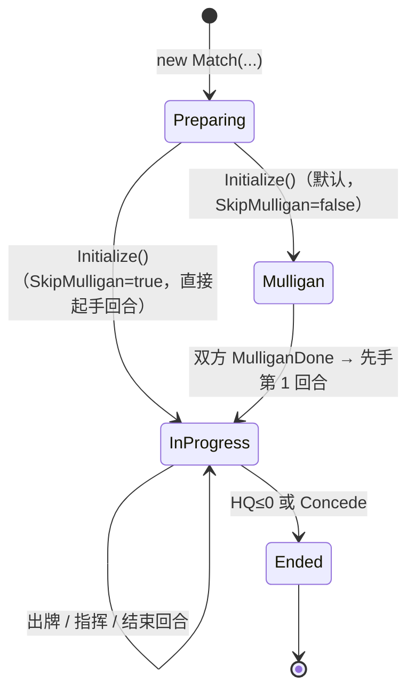

# 游戏层对局端到端流程（索引）

> 受众：**Godot 前端开发者**、对接本引擎的 AI agent。
> 用途：把 `src/Orc.Game`（游戏层）与必要处的 `src/Orc`（内核）的**对局端到端流程**，以及每步**可介入/可观察的 hook 位置**对齐到同一条时序上，降低前端开发阻力。
> 基线：**2026-10-07**；全文**以符号名（类型.方法）为准**，行号仅作参考、会漂移。
> 边界：本文档**不放源码**；信号目录全文、输入点签名表全文**链接既有文档**，不复制（避免第二真源）。

---

## 0. 一句话模型

引擎每完成**一次动作**（出牌、指挥、结束回合、初始化……），把该动作产生的一"段"事件流放入队列，**前端轮询取段**异步播放；同时前端可注册**非阻塞 handler** 收即时更新用于瞬时反馈；前端的**输入**经 `Match` 上的管理器调用动作入口；当引擎需要玩家**做目标选择**时，**反向**经 `ITargeterBridge` 向 UI 索取，UI 应答后引擎继续。规则真值**只在引擎**——UI 不算规则、不猜状态、不泄露隐藏信息。

三类"接线"概念的定位（`CONTEXT.md` 权威）：

| 概念 | 含义 | 典型面 |
|---|---|---|
| **接入点** | 效果/外部对局内逻辑的**受控介入位置** | 订阅（`Bus.Mount`）、band 注入（`Effect.Inject`）、判定器替换（`JudicatorRegistry.RegisterModing`） |
| **观察面** | 外部**只读**获取对局进展 | 即时更新监听、段轮询、快照/事件流导出 |
| **扩展点** | **装配期**注入面 | 注册表、提供器、构造注入 |

> 术语提示：`CONTEXT.md` 中 **Hook** 是内核窄义词（"触发器构造期声明的要挂载到的更新字符串"），**不得**以其指代上面的接入点/观察面/扩展点。本文档用「接入点/观察面/扩展点」。

---

## 1. 对局生命周期总览

一次对局的状态机（真源 `MatchLifecycle`；相位 `MatchPhase` 是 `MatchState` 的派生投影）：

- `Match.State`：`Preparing` / `Mulligan` / `InProgress` / `Ended`（单一真源）。
- `Match.Phase`：`Mulligan` / `Play` / `Ended`（派生；`Preparing` 下读取**抛错**）。
- 迁移**单向不可逆**；`Ended` 后只读查询面仍可用，动作入口拒绝。

---

## 2. 【任务 → 最相关文件】路由表（渐进式阅读）

> **给 agent 的硬约束**：**先只读本文件**，据下表**只打开 1–2 个最相关的分文件**；需要更多细节时，再按分文件内"相关文件"索引追加。**不要一次性读完所有文件。**

| 我要做… | 先读（1–2 个） | 再按需追加 |
|---|---|---|
| 建对局、跑初始化、接开局/换牌 | [`01-对局初始化与终局.md`](game-flow/01-对局初始化与终局.md) | `03`（起手/加载） |
| 处理胜负、认输、终局表现 | [`01-对局初始化与终局.md`](game-flow/01-对局初始化与终局.md) | `05`（死亡导致 HQ 归零） |
| 做回合开始/结束的横幅与流程 | [`02-回合与资源.md`](game-flow/02-回合与资源.md) | `01`（首回合） |
| 显示/刷新指挥点槽与点数 | [`02-回合与资源.md`](game-flow/02-回合与资源.md) | — |
| 接入抽牌/弃牌/爆牌/手牌 | [`03-卡牌管理.md`](game-flow/03-卡牌管理.md) | `04`（出牌离手） |
| 接入出牌（单位/指令/反制）交互 | [`04-打出与部署.md`](game-flow/04-打出与部署.md) | `06`（选空槽/选目标） |
| 表现部署拍桌/单位落场 | [`04-打出与部署.md`](game-flow/04-打出与部署.md) | `05`（部署词条） |
| 接入拖动单位（移动/攻击手势） | [`05-指挥与交战.md`](game-flow/05-指挥与交战.md) | `06`（选目标） |
| 播攻击、伤害、反击、死亡表现 | [`05-指挥与交战.md`](game-flow/05-指挥与交战.md) | `07`（数值变化） |
| 做目标/候选选择面板 | [`06-目标选择（异步倒置）.md`](game-flow/06-目标选择（异步倒置）.md) | `04`/`05`（谁发起选靶） |
| 表现攻防数值实时变化、光环 | [`07-修饰器与光环.md`](game-flow/07-修饰器与光环.md) | `05`（伤害） |
| 理解卡面文本怎么变成可跑效果 | [`08-效果体系.md`](game-flow/08-效果体系.md) | `04`/`05`（注入点） |
| 排查事件流 / 段 / 审查链 | [`09-调试工具.md`](game-flow/09-调试工具.md) | `01`–`08` |

---

## 3. 分文件索引

| 文件 | 覆盖流程 | 内容边界（含 / 不含） |
|---|---|---|
| [`01-对局初始化与终局.md`](game-flow/01-对局初始化与终局.md) | ①对局初始化、⑱初始化补充（卡牌加载/效果初始化/判定器初始化+预定义 moding）、②换牌、⑮终局收尾 | 含：构造→Initialize 全序、装配链、换牌、胜负/认输。不含：单卡打出（见 `04`）。 |
| [`02-回合与资源.md`](game-flow/02-回合与资源.md) | ③回合、④资源结算 | 含：回合五连、行动恢复、抽牌位、槽/点结算。不含：抽牌细节（见 `03`）。 |
| [`03-卡牌管理.md`](game-flow/03-卡牌管理.md) | ⑤卡牌管理 | 含：加载/抽/入手/爆牌/弃/回卡组。不含：出牌打出链（见 `04`）。 |
| [`04-打出与部署.md`](game-flow/04-打出与部署.md) | ⑥单位打出+部署、⑦指令打出、⑧反制 | 含：预打出→打出→部署链、加入路径、指令、反制激活↔取消。不含：选目标交互实现（见 `06`）。 |
| [`05-指挥与交战.md`](game-flow/05-指挥与交战.md) | ⑨指挥/移动、⑩交战、⑪伤害、⑫死亡、⑬重触发、⑰关键词 | 含：拖拽分派、复验、互伤/伏击/反击、伤害门户、死亡/亡计、重触发、词条作用点。不含：数值链内部（见 `07`）。 |
| [`06-目标选择（异步倒置）.md`](game-flow/06-目标选择（异步倒置）.md) | ⑭目标选择 | 含：TargeterManager/Targeting、桥接契约、应答三态。不含：谁发起选靶（见 `04`/`05`）。 |
| [`07-修饰器与光环.md`](game-flow/07-修饰器与光环.md) | ⑯修饰器/光环 | 含：修饰链、期限、光环现收集、更新检测、`card.stat.changed` 集中触发。 |
| [`08-效果体系.md`](game-flow/08-效果体系.md) | 效果初始化/DSL/模板/预制体/装载链/injects | 含：效果 DSL、模板效果、效果预制体、`CardEffectRegistry`/`EffectSystem`、注册表装载链、injects 落地。 |
| [`09-调试工具.md`](game-flow/09-调试工具.md) | ⑲调试工具 | 含：事件流日志、段结构、审查链/快照导出（含内核面标注）。 |

---

## 4. hook 总索引表

> 列：**类型**｜**具体面名（代码符号）**｜**所在流程/步骤（文件§）**｜**介入/观察方式**｜**可用性**。
> 可用性：`已具备` / `后置` / `不做`（后两者与 `GameHooks.PendingTriggers` 口径一致）。

### 4.1 观察面

| 面名（符号） | 所在流程/步骤 | 方式 | 可用性 |
|---|---|---|---|
| `LogicEngine.TakeSegments()` | 全流程（动作作用域结束） | 拉取全部待取段（FIFO、取走即移除） | 已具备 |
| `LogicEngine.TryTakeSegment(out seg)` | 同上 | 拉取一段 | 已具备 |
| `LogicEngine.OnImmediateUpdate(handler)` | 全流程（每次 `Emit` 时点） | 注册非阻塞 handler（即时反馈） | 已具备 |
| `LogicEngine.Subscribe(handler)` | 全流程 | 可 `await` 的更新回调 | 已具备 |
| `LogicEngine.Bridge = IEngineBridge` | 全流程 | 编译期强类型单点回调 | 已具备 |
| `Orc.Output.EventStreamJson/EventSegmentJson/SnapshotJson/AuditChainJson.Serialize` | 终局/调试（`09`） | 快照/事件流/审查链导出 | 已具备 |
| `GameUpdates.*`（29 条对外信号） | 见各流程 | 信号名/载荷键常量 | 已具备（目录见既有文档） |

### 4.2 接入点

| 面名（符号） | 所在流程/步骤 | 方式 | 可用性 |
|---|---|---|---|
| `Bus.Mount<TView>(trigger)` | 全流程 | 订阅：被动触发器按构造期 `hooks` 字符串挂到更新总线 | 已具备 |
| `Effect.Inject<TView>(target, band, event, priority)` | 流程触发器具名 band（如 `OrderFlow`/`AttackFlow`/`DamageFlow`） | band 注入（卸载自动撤销） | 已具备 |
| `JudicatorRegistry.RegisterModing(name, moding)` | 各判定点（见 `05`/`04`/`02`） | 判定器替换（全局、栈语义） | 已具备 |
| `Trigger.RegisterModing(target, moding)` | 事件级 | 事件处理替换 | 已具备 |
| 效果预制体 `injects`（`EffectTemplateInject` → `InjectPrefab` → `EffectSystem.ApplyFrameworkInjects`） | 打出/部署/攻击（`04`/`05`/`08`） | 把效果 handler 注入**宿主具名触发器**或**对局具名触发器** | 已具备 |
| `Hq.AddDamageRewriter(...)` / `Hq.AddLethalIntervention(...)` / `Hq.RemovePipelineHooksBySource(...)` | HQ 伤害（`05`/`15§终局`） | HQ 数值管线介入 | 已具备 |
| `UnitCard.ApplyDefenseDamageAsync(...)` / `Hq.ApplyDamageAsync(...)` | 伤害（`05`） | 受控数值门户入口 | 已具备 |

### 4.3 扩展点

| 面名（符号） | 装配阶段 | 方式 | 可用性 |
|---|---|---|---|
| `new Match(...)`：`targeterBridge` / `effectRegistry` / `deckConfigForPlayerA/B` / `seed` / `firstPlayerIndex` / `options` / `judicatorAssembly` | 构造期（`01`） | 构造注入 | 已具备 |
| `JudicatorRegistry.Register(name, judicator)` | `Match.Initialize` 内置注册段 + 外部装配段 `judicatorAssembly` | 注册即配置、重复拒绝 | 已具备 |
| `CardEffectRegistry.Register/Declare/DeclarePrefab` | 装配期（`08`） | 效果实例化/声明注入 | 已具备 |
| `KeywordRegistry.Register(keyword, factory, isBattleKeyword)` | 装配期（`05`/`08`） | 词条工厂（进程级、开放扩展） | 已具备 |
| `TriggerRegistry.Register(trigger, layer)`（`TriggerLayer.LowLevel/External`） | `Match.Initialize`（`01`） | 触发器分层登记 | 已具备 |
| `PrefabManager.RegisterHandler/RegisterPrefab/LoadDirectory` | 装配期（`08`） | 效果预制体来源（程序集/csx/`*.prefab.json` 目录） | 已具备 |
| `CardLibrary.Register(id, definition)` | 装配期（`01`） | 卡定义注册 | 已具备 |
| `LogicEngine.RegisterCardMountCompletedAction(...)` | 装配期（`08`） | 装载完成动作 | 已具备 |
| `LogicEngine.ScriptEvaluator = IScriptEvaluator` | 装配期（`08`） | csx 脚本求值器 | 已具备 |
| `CardBase.RegisterNamedTrigger(name, trigger, viewType)` | 卡的构造期（`04`/`08`） | 卡的**具名触发器**（`injects` 的宿主解析目标） | 已具备 |

---

## 5. 效果预制体总表

> **模板效果**（`*.tpl.json`，`EffectParsing/Templates/`）：逐事件一个，`hooks` ＝监听的更新字符串（＝对外信号字面值）；`attack_basic` 特殊——经 `injects` 挂到「单位攻击触发器」。
> 运行期**效果预制体**（`*.prefab.json`，`PrefabManager`）为程序集/目录来源的效果快照，本仓当前 0 个；详见 `08`。

| 模板 id | 对应流程位 / 监听 hook | inject 目标触发器 | 文件 |
|---|---|---|---|
| `turn_start_before_basic` | 回合开始前 / `turn.start.before` | — | `Templates/turn_start_before_basic.tpl.json` |
| `turn_start_basic` | 回合开始 / `turn.start` | — | `Templates/turn_start_basic.tpl.json` |
| `turn_end_before_basic` | 回合结束前 / `turn.end.before` | — | `Templates/turn_end_before_basic.tpl.json` |
| `turn_end_basic` | 回合结束 / `turn.end` | — | `Templates/turn_end_basic.tpl.json` |
| `played_basic` | 出牌 / `card.played` | — | `Templates/played_basic.tpl.json` |
| `drawn_basic` | 抽牌 / `card.drawn` | — | `Templates/drawn_basic.tpl.json` |
| `hand_add_basic` | 入手牌 / `card.hand.add` | — | `Templates/hand_add_basic.tpl.json` |
| `discard_basic` | 弃牌 / `card.discarded` | — | `Templates/discard_basic.tpl.json` |
| `burn_basic` | 爆牌 / `card.burned` | — | `Templates/burn_basic.tpl.json` |
| `load_basic` | 卡牌加载 / `card.load` | — | `Templates/load_basic.tpl.json` |
| `placed_basic` | 卡牌放置 / `card.placed`（内核信号） | — | `Templates/placed_basic.tpl.json` |
| `destroy_basic` | 卡牌销毁 / `card.destroyed`（内核信号） | — | `Templates/destroy_basic.tpl.json` |
| `stat_basic` | 数值变化 / `card.stat.changed` | — | `Templates/stat_basic.tpl.json` |
| `types_basic` | 类型变化 / `unit.types.changed` | — | `Templates/types_basic.tpl.json` |
| `deploy_basic` | 部署 / `unit.deployed` | — | `Templates/deploy_basic.tpl.json` |
| `deploy_listener` | 监听部署 / `unit.deployed` | — | `Templates/deploy_listener.tpl.json` |
| `join_basic` | 加入 / `unit.joined` | — | `Templates/join_basic.tpl.json` |
| `position_basic` | 位置变化 / `unit.position.changed` | — | `Templates/position_basic.tpl.json` |
| `shuffle_basic` | 洗切 / `deck.shuffled` | — | `Templates/shuffle_basic.tpl.json` |
| `attack_basic` | 攻击执行 | **单位攻击触发器** | `Templates/attack_basic.tpl.json` |
| `damaged_basic` | 受伤 / `card.damaged` | — | `Templates/damaged_basic.tpl.json` |
| `damage_dealt_basic` | 造成伤害 / `unit.damage.dealt` | — | `Templates/damage_dealt_basic.tpl.json` |
| `acted_basic` | 单位行动后 / `unit.acted` | — | `Templates/acted_basic.tpl.json` |
| `combat_survived_basic` | 交战存活 / `unit.combat.survived` | — | `Templates/combat_survived_basic.tpl.json` |
| `death_basic` | 死亡 / `card.died` | — | `Templates/death_basic.tpl.json` |
| `killed_basic` | 击杀视角 / `card.died` | — | `Templates/killed_basic.tpl.json` |
| `counter_basic` | 反制触发 / `counter.triggered` | — | `Templates/counter_basic.tpl.json` |
| `slot_gained_basic` | 获得点槽 / `slot.gained` | — | `Templates/slot_gained_basic.tpl.json` |
| `slot_lost_basic` | 失去点槽 / `slot.lost` | — | `Templates/slot_lost_basic.tpl.json` |

> 真源：`Templates/` 目录（29 个 `*.tpl.json`）；`injects` 落地解析见 `08`。

---

## 6. 术语速查

| 术语 | 一句话 | 权威 |
|---|---|---|
| 事件流段（段） | 一次动作产生的引擎内部信号聚合，动作结束时产出 | 根 `CONTEXT.md` |
| 段轮询 | UI 主动取段的拉取式消费 | 根 `CONTEXT.md` |
| 即时更新监听 | 非阻塞 handler，更新广播时被调用 | 根 `CONTEXT.md` |
| 接入点/观察面/扩展点 | 见 §0 | 根 `CONTEXT.md` |
| HQ | 玩家总部，初始血量 20，独立实体（支援线槽 0） | 根 `CONTEXT.md` |
| 爆牌（burn） | 手牌上限（9）满时新牌被销毁；独立信号，不走弃牌路线 | 根 `CONTEXT.md` |

---

## 7. 既有文档交叉链接（避免第二真源）

- [UI 开发者交接文档](ui-开发者交接文档.md) —— UI 三主线（段轮询/即时监听/输入集成）与端到端串联示例、API 签名表。
- [OrC 引擎用户输入点分析报告](orc-用户输入点分析报告.md) —— **输入点全集**与各类 hook 面分析。
- [kards-diy 游戏流程分析报告](kards-diy-游戏流程分析报告.md) —— 对照 kards-diy 的流程基线（含规则参数差异）。
- `.ams/context/ui-event-stream/ui-integration-guide.md` —— 信号来源与"如何新增信号"。
- `.ams/context/ui-handover/` —— UI 交接的需求/实现过程资产。
- 代码侧索引：`Orc.Game.GameEntryPoints`（输入入口全集）、`Orc.Game.GameHooks`（接入点/观察面/扩展点聚合索引）、`Orc.Game.GameUpdates`（对外信号常量）。

> **已知滞后**：`GameEntryPoints.cs` 把 `MulliganReplace`/`MulliganDone`/`Concede` 记为 `PendingDelivery`，但实际已在 `Match.cs` 落地（且入口名为 `BeginMulliganAsync`/`MulliganDone`/`Concede`，无 `MulliganReplace`）。**以 `Match.cs` 实际代码为准**。

> **单真源声明**：信号名/载荷键/判定器名以代码常量（`Orc.Core.Updates` / `Orc.Game.GameUpdates` / `JudicatorNames`）为唯一权威；术语以根 `CONTEXT.md` 为准。
